class: center, middle

```{css, echo=FALSE}
pre {
  max-height: 400px;
  overflow-y: auto;
}

pre[class] {
  max-height: 200px;
}
```

```{css, echo=FALSE}
.scroll-100 {
  max-height: 100px;
  overflow-y: auto;
  background-color: inherit;
}
```

```{r, load_refs, include=FALSE, cache=FALSE}
# Initializes the bibliography
library(RefManageR)

library(ggplot2)
library(dplyr)
library(readr)
library(nlme)
library(jtools)
library(hrbrthemes)
library(mice)
library(knitr)
options(warn=-1)

BibOptions(check.entries = FALSE,
           bib.style = "authoryear", # Bibliography style
           max.names = 3, # Max author names displayed in bibliography
           sorting = "nyt", #Name, year, title sorting
           cite.style = "authoryear", # citation style
           style = "markdown",
           hyperlink = FALSE,
           dashed = FALSE)
#myBib <- ReadBib("assets/myBib.bib", check = FALSE)
# Note: don't forget to clear the knitr cache to account for changes in the
# bibliography.
```
```{r xaringan-themer, include=FALSE, warning=FALSE}
library(xaringanthemer,MnSymbol)
style_mono_accent(
  base_color = "#1c5253",
  header_font_google = google_font("Josefin Sans"),
  text_font_google   = google_font("Montserrat", "300", "300i"),
  code_font_google   = google_font("Fira Mono"),
  text_font_size = "1.3rem"
)
```

---
### Experiments

---
```{r, echo = TRUE, out.width="100%", fig.retina = 1}
library(dagitty)
experiment.graph <- dagitty( "dag {
     W1 -> Z1 -> X -> Y
     Z1 <- RandomIntervention -> Z2
     W2 -> Z2 -> Y
     X <-> W1 <-> W2 <-> Y
 }")
```

---
```{r, echo = TRUE, out.width="80%", fig.retina = 1}
plot(graphLayout(experiment.graph))
```

---
```{r, echo = FALSE, out.width="100%", fig.retina = 1}
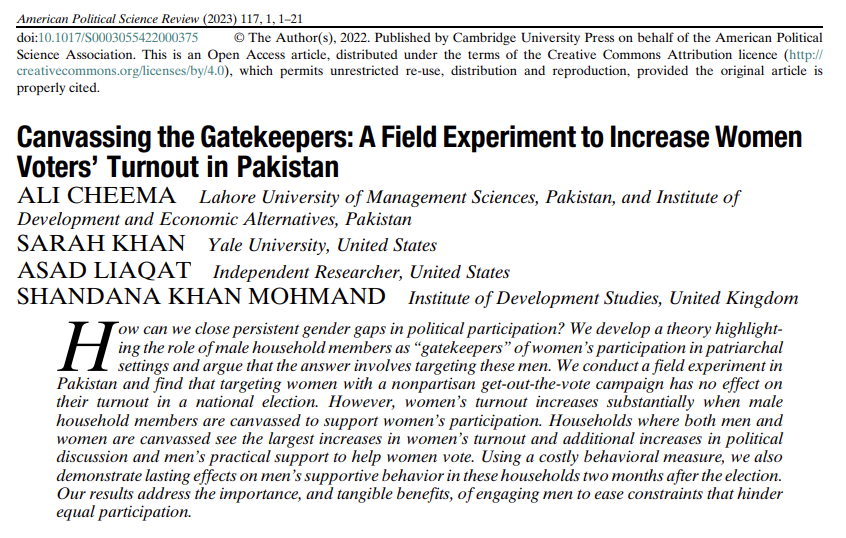
```

---
```{r, echo = FALSE, out.width="100%", fig.retina = 1}
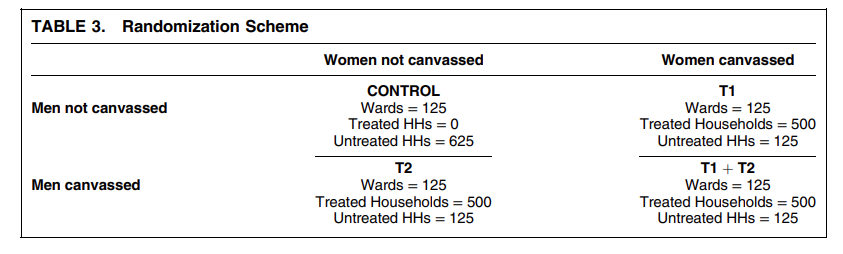
```

---
```{r, echo = FALSE, out.width="100%", fig.retina = 1}
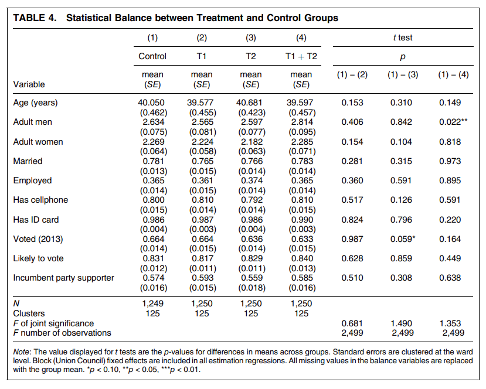
```

---
```{r, echo = FALSE, out.width="100%", fig.retina = 1}
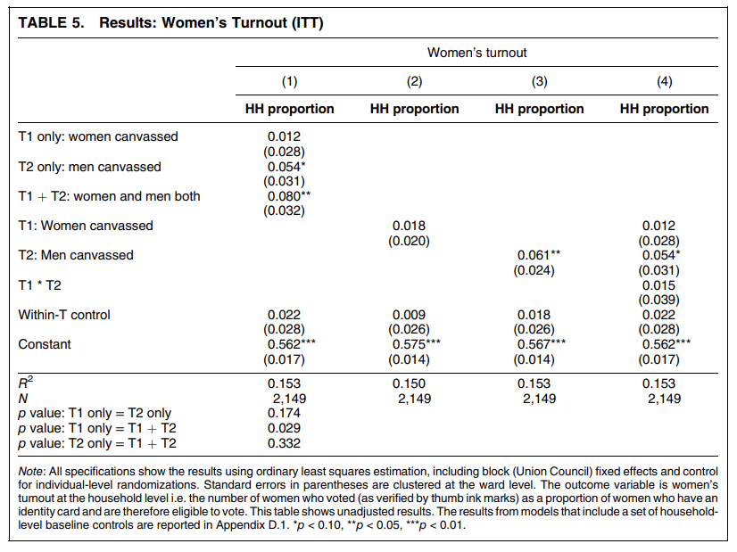
```

---
### Natural Experiments

---
```{r, echo = TRUE, out.width="100%", fig.retina = 1}
library(dagitty)
naturalexperiment.graph <- dagitty( "dag {
     W1 -> Z1 -> X -> Y
     Z1 <- RandomEvent -> Z2
     W2 -> Z2 -> Y
     X <-> W1 <-> W2 <-> Y
 }")
```

---
```{r, echo = FALSE, out.width="80%", fig.retina = 1}
plot(graphLayout(naturalexperiment.graph))
```

---
### Vietnam War Draft Lottery

---
```{r, echo = FALSE, out.width="85%", fig.retina = 1, fig.align='center'}
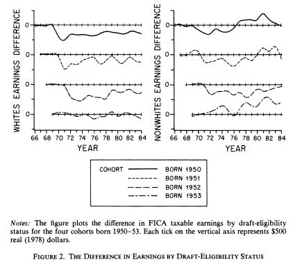
```

---
```{r, echo = FALSE, out.width="100%", fig.retina = 1, fig.align='center'}
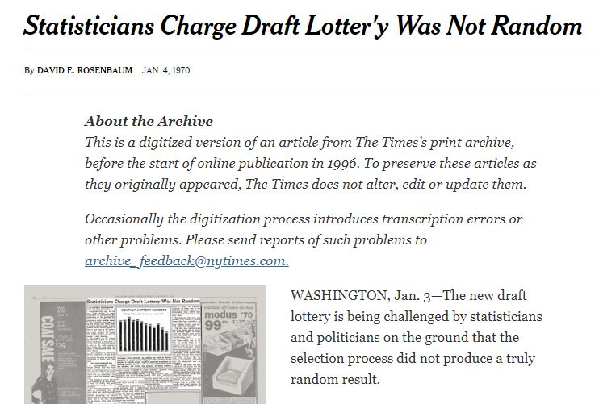
```

---
```{r, echo = TRUE, out.width="100%", fig.retina = 1, fig.align='center'}
draft1970 <- read_csv("draft1970.csv")
```
---
```{r, echo = TRUE, out.width="70%", fig.retina = 1, fig.align='center'}
boxplot(rank~month, data=draft1970)
```

---
```{r, echo = TRUE, out.width="100%", fig.retina = 1, fig.align='center'}
draftlm <- lm(rank ~ day, data=draft1970)
```
---
```{r, echo = TRUE, out.width="100%", fig.retina = 1, fig.align='center'}
summ(draftlm)
```
---
```{r, echo = TRUE, out.width="100%", fig.retina = 1, fig.align='center'}
draft1971 <- read_csv("draft1971.csv")
```
---
```{r, echo = TRUE, out.width="70%", fig.retina = 1, fig.align='center'}
boxplot(rank~month, data=draft1971)
```

---
```{r, echo = TRUE, out.width="100%", fig.retina = 1, fig.align='center'}
draft71lm <- lm(rank ~ day, data=draft1971)
```
---
```{r, echo = TRUE, out.width="100%", fig.retina = 1, fig.align='center'}
summ(draft71lm)
```

---
### Regression Discontinuity Design

---
```{r, echo = TRUE, out.width="100%", fig.retina = 1}
library(dagitty)
rdd.graph <- dagitty( "dag {
     Z -> AssignmentRule -> X -> Y
 }")
```

---
```{r, echo = FALSE, out.width="80%", fig.retina = 1}
plot(graphLayout(rdd.graph))
```

---
```{r, echo = FALSE, out.width="65%", fig.retina = 1, fig.align='center'}
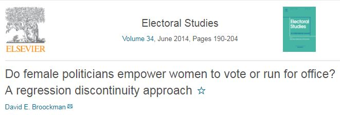
```

---
```{r, echo = FALSE, out.width="65%", fig.retina = 1, fig.align='center'}
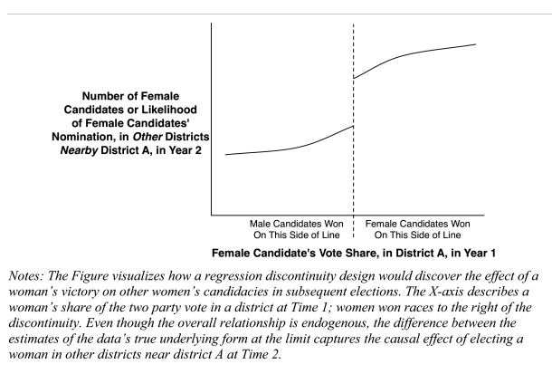
```

---
```{r, echo = FALSE, out.width="65%", fig.retina = 1, fig.align='center'}
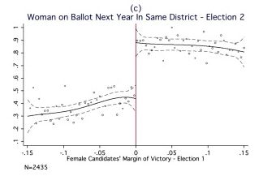
```

---
```{r, echo = FALSE, out.width="65%", fig.retina = 1, fig.align='center'}
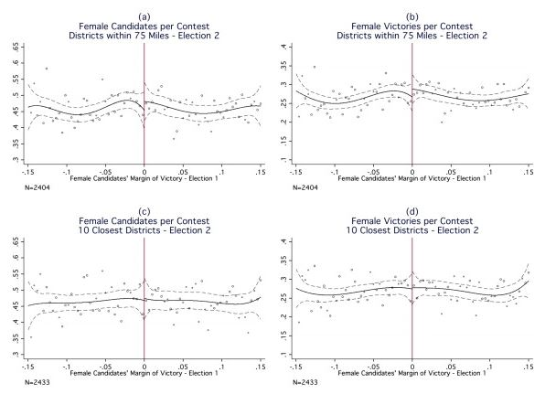
```

---
### Difference-in-Differences

---
```{r, echo = TRUE, out.width="100%", fig.retina = 1}
library(dagitty)
diffindiff.graph <- dagitty( "dag {
     W1 -> Z1 -> ChangeinX -> ChangeinY
     Z1 <- Z3 -> Z2
     W2 -> Z2 -> Y
     X <-> W1 <-> W2 <-> Y
     X -> Y
 }")
```

---
```{r, echo = FALSE, out.width="80%", fig.retina = 1}
plot(graphLayout(diffindiff.graph))
```

---
```{r, echo = FALSE, out.width="90%", fig.retina = 1, fig.align='center'}
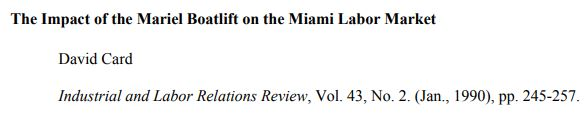
```

---
```{r, echo = FALSE, out.width="90%", fig.retina = 1, fig.align='center'}
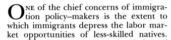
```

---
```{r, echo = FALSE, out.width="90%", fig.retina = 1, fig.align='center'}
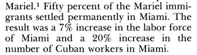
```

---
```{r, echo = FALSE, out.width="90%", fig.retina = 1, fig.align='center'}
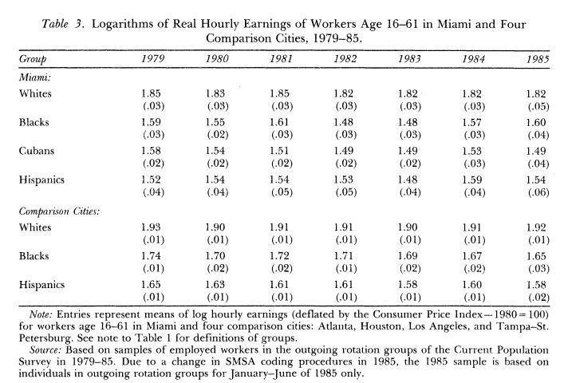
```

---
```{r, echo = FALSE, out.width="90%", fig.retina = 1, fig.align='center'}
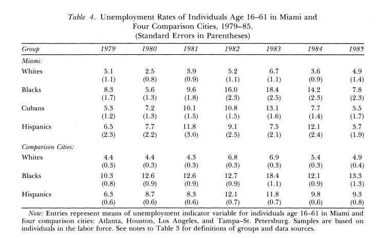
```

---
```{r, echo = FALSE, out.width="90%", fig.retina = 1, fig.align='center'}
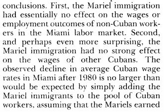
```

