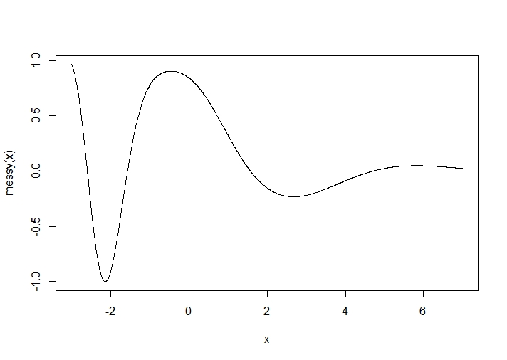
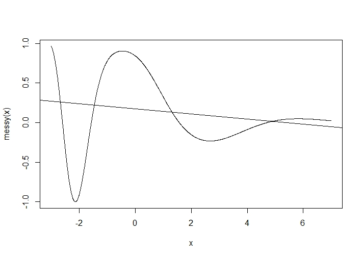
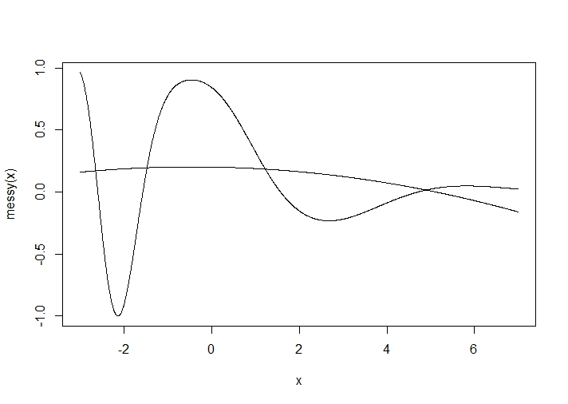
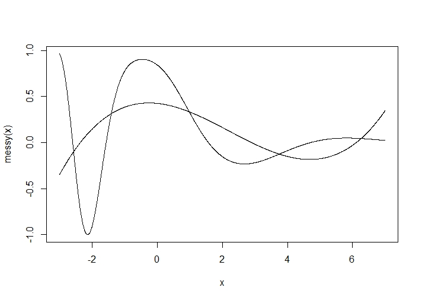
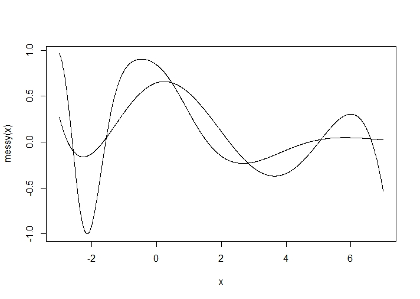

class: center, middle

```{css, echo=FALSE}
pre {
  max-height: 400px;
  overflow-y: auto;
}

pre[class] {
  max-height: 200px;
}
```

```{css, echo=FALSE}
.scroll-100 {
  max-height: 100px;
  overflow-y: auto;
  background-color: inherit;
}
```

```{r, load_refs, include=FALSE, cache=FALSE}
# Initializes the bibliography
library(RefManageR)

library(ggplot2)
library(dplyr)
library(readr)
library(nlme)
library(jtools)
library(hrbrthemes)
library(mice)
options(warn=-1)

BibOptions(check.entries = FALSE,
           bib.style = "authoryear", # Bibliography style
           max.names = 3, # Max author names displayed in bibliography
           sorting = "nyt", #Name, year, title sorting
           cite.style = "authoryear", # citation style
           style = "markdown",
           hyperlink = FALSE,
           dashed = FALSE)
#myBib <- ReadBib("assets/myBib.bib", check = FALSE)
# Note: don't forget to clear the knitr cache to account for changes in the
# bibliography.
```
```{r xaringan-themer, include=FALSE, warning=FALSE}
library(xaringanthemer,MnSymbol)
style_mono_accent(
  base_color = "#1c5253",
  header_font_google = google_font("Josefin Sans"),
  text_font_google   = google_font("Montserrat", "300", "300i"),
  code_font_google   = google_font("Fira Mono"),
  text_font_size = "1.3rem"
)
```


### Making Curves Linear

-   Taylor-series expansion

---

---

---

---

---

---
### Testing for Curves

We can add nonlinear transformations of our independent variables as additional right-hand-side variables in a regression.

---
```{r, echo = TRUE, out.width="100%", fig.retina = 1, fig.align='center'}
library(haven)
uscinski2 <- read_dta("uscinski2.dta")
uscinski2$conspiratorial <- with(uscinski2, con1 + con2 + con3 +con4)
```

---
```{r, echo = TRUE, out.width="70%", fig.retina = 1, fig.align='center'}
qft3.lm <- lm(qanonft~conspiratorial+pid+ideo+female+age+income+edu, data = uscinski2)
summary(qft3.lm)
```

---
```{r, echo = TRUE, out.width="70%", fig.retina = 1, fig.align='center'}
qft.nonlin <- lm(qanonft~conspiratorial+pid+ideo+female+age+I(age^2)+income+I(income^2) + edu+I(edu^2), data = uscinski2)
summary(qft.nonlin)
```

---
```{r, echo = TRUE, out.width="70%", fig.retina = 1, fig.align='center'}
library(ggeffects)
qft.age.interpret <- ggpredict(qft.nonlin, terms=c("age"))
```

---
```{r, echo = TRUE, out.width="70%", fig.retina = 1, fig.align='center'}
plot(qft.age.interpret)
```

---
```{r, echo = TRUE, out.width="70%", fig.retina = 1, fig.align='center'}
qft.income.interpret <- ggpredict(qft.nonlin, terms=c("income"))
```

---
```{r, echo = TRUE, out.width="70%", fig.retina = 1, fig.align='center'}
plot(qft.income.interpret)
```

---
```{r, echo = TRUE, out.width="70%", fig.retina = 1, fig.align='center'}
qft.edu.interpret <- ggpredict(qft.nonlin, terms=c("edu"))
```

---
```{r, echo = TRUE, out.width="70%", fig.retina = 1, fig.align='center'}
plot(qft.edu.interpret)
```

---
```{r, echo = TRUE, out.width="70%", fig.retina = 1, fig.align='center'}
anova(qft3.lm,qft.nonlin)
```

---
### How Far Can We Go?

The upper limit of complexity in terms of linearity is determined by the measurement structure of our variables, and not just the number of cases.

---
```{r, echo = TRUE, out.width="70%", fig.retina = 1, fig.align='center'}
table(uscinski2$income)
```

---
```{r, echo = TRUE, out.width="70%", fig.retina = 1, fig.align='center'}
qft.inc2 <- lm(qanonft~conspiratorial+pid+ideo+female+age+income+I(income^2)+edu, data = uscinski2)
summary(qft.inc2)
```

---
```{r, echo = TRUE, out.width="70%", fig.retina = 1, fig.align='center'}
qft.inc3 <- lm(qanonft~conspiratorial+pid+ideo+female+age+income+I(income^2)+I(income^3)+edu, data = uscinski2)
summary(qft.inc3)
```

---
```{r, echo = TRUE, out.width="70%", fig.retina = 1, fig.align='center'}
qft.inc4 <- lm(qanonft~conspiratorial+pid+ideo+female+age+income+I(income^2)+I(income^3)+I(income^4)+edu, data = uscinski2)
summary(qft.inc4)
```

---
```{r, echo = TRUE, out.width="70%", fig.retina = 1, fig.align='center'}
qft.inc5 <- lm(qanonft~conspiratorial+pid+ideo+female+age+income+I(income^2)+I(income^3)+I(income^4)+I(income^5)+edu, data = uscinski2)
summary(qft.inc5)
```

---
```{r, echo = TRUE, out.width="70%", fig.retina = 1, fig.align='center'}
qft.inc6 <- lm(qanonft~conspiratorial+pid+ideo+female+age+income+I(income^2)+I(income^3)+I(income^4)+I(income^5)+ I(income^6)+edu, data = uscinski2)
summary(qft.inc6)
```

---
```{r, echo = TRUE, out.width="70%", fig.retina = 1, fig.align='center'}
qft.inc7 <- lm(qanonft~conspiratorial+pid+ideo+female+age+income+I(income^2)+I(income^3)+I(income^4)+I(income^5)+ I(income^6) + I(income^7) +edu, data = uscinski2)
summary(qft.inc7)
```

---
```{r, echo = TRUE, out.width="70%", fig.retina = 1, fig.align='center'}
qft.inc6.interpret <- ggpredict(qft.inc6, terms=c("income"))
```

---
```{r, echo = TRUE, out.width="70%", fig.retina = 1, fig.align='center'}
plot(qft.inc6.interpret)
```


---
### Theory Testing vs. Data-Driven Discovery

How often do we have detailed prior theories about the nonlinear structure of our data?
