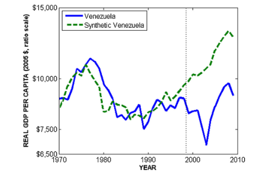
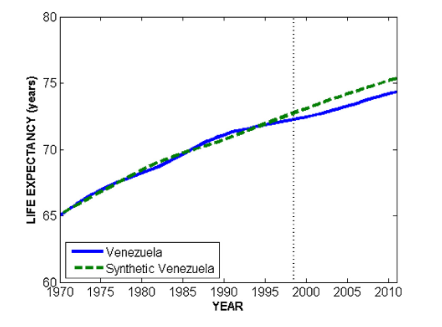
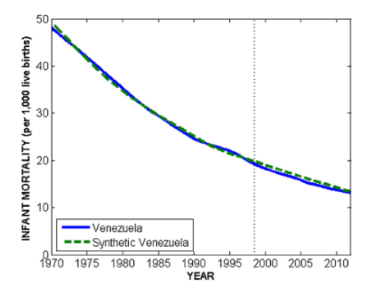

class: center, middle

```{css, echo=FALSE}
pre {
  max-height: 400px;
  overflow-y: auto;
}

pre[class] {
  max-height: 200px;
}
```

```{r, load_refs, include=FALSE, cache=FALSE}
# Initializes the bibliography
library(RefManageR)

library(ggplot2)
library(dplyr)
library(readr)
library(nlme)
library(jtools)

BibOptions(check.entries = FALSE,
           bib.style = "authoryear", # Bibliography style
           max.names = 3, # Max author names displayed in bibliography
           sorting = "nyt", #Name, year, title sorting
           cite.style = "authoryear", # citation style
           style = "markdown",
           hyperlink = FALSE,
           dashed = FALSE)
#myBib <- ReadBib("assets/myBib.bib", check = FALSE)
# Note: don't forget to clear the knitr cache to account for changes in the
# bibliography.

```
```{r xaringan-themer, include=FALSE, warning=FALSE}
library(xaringanthemer,MnSymbol)
style_mono_accent(
  base_color = "#1c5253",
  header_font_google = google_font("Josefin Sans"),
  text_font_google   = google_font("Montserrat", "300", "300i"),
  code_font_google   = google_font("Fira Mono"),
  text_font_size = "1.6rem"
)
```

---
### Manufacture Perfect Comparisons

For a perfect causal comparison between cases 1 and 2, the condition which must be met is:

$$\begin{aligned}
Y_{1,t} = Y_{2,t}\\
Y_{1,c} = Y_{2,c}\end{aligned}$$

---
### Manufacture Perfect Comparisons

No observable condition can ever guarantee that this assumption is met,
but if we were to find two cases that *exactly* match on a suitably rich
set of background variables $\mathbb{Z}$, perhaps, we would come close to believing the
assumption.

---
### Manufacture Perfect Comparisons

Unfortunately, if $\mathbb{Z}$ is indeed a reasonably deep list of
variables, we are unlikely to find cases that in fact exactly match (or
even come particularly close).

---
### Manufacture Perfect Comparisons

Abadie and collaborators suggest that we create our own "synthetic"
control cases, by averaging together existing control cases to come as
close as possible to exactly matching the treatment case on
$\mathbb{Z}$.

---
### Synthetic Control

The setup is one in which there are $N$ cases, each of which is observed
at multiple time periods labeled from 1 through $T$.

---
### Synthetic Control

Each case has a treatment and control potential outcome for each time
period. The difference between these is:

$\alpha_{i,t} = Y^T_{i,t} - Y^C_{i,t}$

---
### Synthetic Control

Suppose that the treatment of interest happens in *one* case at one time
period. That is, $D_{j,t}=0$ for all $j \neq i$ and for all
$t < t_{treat}$.

---
### Synthetic Control

Let $X_{i} = (\mathbb{Z}_{i}, Y_{i})$

Minimize $X_{i, t} -  \mathbb{X}_{j, t} W$ for $t < t_{treat}$.

---
### Synthetic Control

$\sqrt{(X_{i, t} -  \mathbb{X}_{j, t} W)^{T} V (X_{i, t} -  \mathbb{X}_{j, t} W)}$

---
```{r, echo = FALSE, out.width="90%", fig.retina = 1, fig.align='center'}
library(knitr)
include_graphics("choosingv.png")
```

---
```{r, echo = FALSE, out.width="90%", fig.retina = 1, fig.align='center'}
library(knitr)

```

---
```{r, echo = FALSE, out.width="90%", fig.retina = 1, fig.align='center'}
library(knitr)
include_graphics("chavezsynth2.png")
```

---
```{r, echo = FALSE, out.width="90%", fig.retina = 1, fig.align='center'}
library(knitr)

```

---
```{r, echo = FALSE, out.width="90%", fig.retina = 1, fig.align='center'}
library(knitr)

```

---
```{r, echo = FALSE, out.width="90%", fig.retina = 1, fig.align='center'}
library(knitr)

```

---
```{r, echo = FALSE, out.width="90%", fig.retina = 1, fig.align='center'}
library(knitr)

```

---
```{r, echo = FALSE, out.width="90%", fig.retina = 1, fig.align='center'}
library(knitr)
include_graphics("chavezsynth7.png")
```

---
```{r, echo = FALSE, out.width="90%", fig.retina = 1, fig.align='center'}
library(knitr)
include_graphics("chavezsynth8.png")
```

---
```{r, echo = FALSE, out.width="90%", fig.retina = 1, fig.align='center'}
library(knitr)
include_graphics("chavezsynth9.png")
```

---
```{r, echo = FALSE, out.width="90%", fig.retina = 1, fig.align='center'}
include_graphics("DeKadt1.png")
```

---
```{r, echo = FALSE, out.width="90%", fig.retina = 1, fig.align='center'}
include_graphics("DeKadt2.png")
```

---
```{r, echo = FALSE, out.width="90%", fig.retina = 1, fig.align='center'}

```

---
```{r, echo = FALSE, out.width="90%", fig.retina = 1, fig.align='center'}
include_graphics("DeKadt4.png")
```

---
```{r, echo = TRUE, out.width="90%", fig.retina = 1, fig.align='center'}
library(Synth)
```

---
```{r, echo = TRUE, out.width="90%", fig.retina = 1, fig.align='center'}
afripanel <- read.csv("afripanel.csv")

malidata <- afripanel[afripanel$WBCode=="MLI" | afripanel$cont_dem_ind==1,]

malicontrols <- unique(malidata$WBCode[malidata$WBCode!="MLI"&malidata$WBCode!="ETH"&malidata$WBCode!="SDN"])
```

---
```{r, echo = TRUE, out.width="90%", fig.retina = 1, fig.align='center'}
mali.prep <- dataprep(
    foo=malidata, 
    predictors=c(
      "lngdpmadlag",
      "lngdpmadlag2",
      "lngdpmadlag3",
      "lngdpmadlag4",
      "lnpop",
      "ki",
      "openk",
      "civwar",
      "civwarend",
      "pwt_xrate",
      "pwt_xrate_lag1",
      "pwt_xrate_lag2",
      "pwt_xrate_lag3",
      "eximdiff",
      "eximdiff_lag1",
      "eximdiff_lag2",
      "wbank",
      "wbank_lag1",
      "wbank_lag2",
      "imfadj",
      "imfadj_lag1",
      "imfadj_lag2"
    ),
    dependent="lngdpmad",
    unit.variable="wbcode2",
    time.variable="year", 
    treatment.identifier="MLI", 
    controls.identifier=malicontrols,          
    time.predictors.prior=c(1975:1990),
    time.optimize.ssr=c(1975:1991),
    time.plot=c(1975:2008),
    unit.names.variable="WBCode"
)
```

---
```{r, echo = TRUE, out.width="90%", fig.retina = 1, fig.align='center'}
mali.synth <- synth(mali.prep)
```

---
```{r, echo = TRUE, out.width="60%", fig.retina = 1, fig.align='center'}
path.plot(synth.res=mali.synth, dataprep.res=mali.prep,
           Ylab="Log GDP per capita", Legend=NA, tr.intake=1991,
           Ylim=c(6,8) , Main="Mali"
)
```
