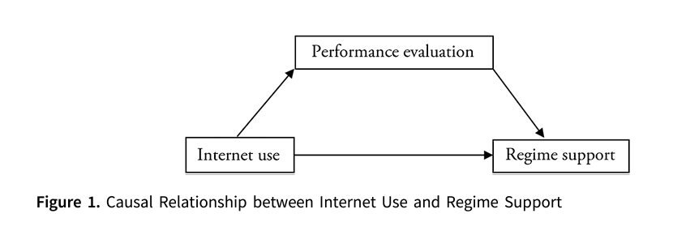

class: center, middle

```{css, echo=FALSE}
pre {
  max-height: 400px;
  overflow-y: auto;
}

pre[class] {
  max-height: 200px;
}
```

```{css, echo=FALSE}
.scroll-100 {
  max-height: 100px;
  overflow-y: auto;
  background-color: inherit;
}
```

```{r, load_refs, include=FALSE, cache=FALSE}
# Initializes the bibliography
library(RefManageR)

library(ggplot2)
library(dplyr)
library(readr)
library(nlme)
library(jtools)
library(hrbrthemes)
library(mice)
options(warn=-1)

BibOptions(check.entries = FALSE,
           bib.style = "authoryear", # Bibliography style
           max.names = 3, # Max author names displayed in bibliography
           sorting = "nyt", #Name, year, title sorting
           cite.style = "authoryear", # citation style
           style = "markdown",
           hyperlink = FALSE,
           dashed = FALSE)
#myBib <- ReadBib("assets/myBib.bib", check = FALSE)
# Note: don't forget to clear the knitr cache to account for changes in the
# bibliography.
```
```{r xaringan-themer, include=FALSE, warning=FALSE}
library(xaringanthemer,MnSymbol)
style_mono_accent(
  base_color = "#1c5253",
  header_font_google = google_font("Josefin Sans"),
  text_font_google   = google_font("Montserrat", "300", "300i"),
  code_font_google   = google_font("Fira Mono"),
  text_font_size = "1.3rem"
)
```

---
### Interactions and Mediation

-   Interactions

-   Mediation

-   First, moderation/background factors

---


---
What if the effect of the internet on democracy depends on a country's colonial
history?

---


---


---


---
```{r, echo = TRUE, out.width="100%", fig.retina = 1, fig.align='center'}
library(devtools)
library(rqog)
qualityofgovernment <- read_qog(which_data="basic", data_type = "time-series")
qualityofgovernment$loggdp <- log(qualityofgovernment$wdi_gdpcappppcon2017)
```

---
```{r, echo = TRUE, out.width="100%", fig.retina = 1, fig.align='center'}
internet.startinglm <- lm(p_polity2 ~ wdi_internet + loggdp + factor(ht_colonial), data=qualityofgovernment)
```

---
```{r, echo = TRUE, out.width="100%", fig.retina = 1, fig.align='center'}
summary(internet.startinglm)
```

---


---
```{r, echo = TRUE, out.width="100%", fig.retina = 1, fig.align='center'}
internet.colonialint <- lm(p_polity2 ~ wdi_internet + loggdp + factor(ht_colonial) + wdi_internet:factor(ht_colonial), data=qualityofgovernment)
```

---
```{r, echo = TRUE, out.width="100%", fig.retina = 1, fig.align='center'}
summary(internet.colonialint)
```

---
```{r, echo = TRUE, out.width="100%", fig.retina = 1, fig.align='center'}
library(ggeffects)
colonial.interaction.interpret <- ggpredict(internet.colonialint, terms = c("wdi_internet", "ht_colonial"))
```

---
```{r, echo = TRUE, out.width="100%", fig.retina = 1, fig.align='center'}
c25 <- c(
  "dodgerblue2", "#E31A1C", # red
  "green4",
  "#6A3D9A", # purple
  "#FF7F00", # orange
  "black", "gold1",
  "skyblue2", "#FB9A99", # lt pink
  "palegreen2",
  "#CAB2D6", # lt purple
  "#FDBF6F", # lt orange
  "gray70", "khaki2",
  "maroon", "orchid1", "deeppink1", "blue1", "steelblue4",
  "darkturquoise", "green1", "yellow4", "yellow3",
  "darkorange4", "brown"
)
```

---
```{r, echo = TRUE, out.width="60%", fig.retina = 1, fig.align='center'}
plot(colonial.interaction.interpret, facet=TRUE, colors=c25)
```

---
```{r, echo = TRUE, out.width="60%", fig.retina = 1, fig.align='center'}
table(qualityofgovernment$ht_colonial,(qualityofgovernment$wdi_internet>30))
```

---
```{r, echo = TRUE, out.width="60%", fig.retina = 1, fig.align='center'}
qogtrim <- qualityofgovernment %>% filter(ht_colonial %in% c(0:2,4:7))
```

---
```{r, echo = TRUE, out.width="100%", fig.retina = 1, fig.align='center'}
internet.colonialint2 <- lm(p_polity2 ~ wdi_internet + loggdp + factor(ht_colonial) + wdi_internet:factor(ht_colonial), data=qogtrim)
```

---
```{r, echo = TRUE, out.width="100%", fig.retina = 1, fig.align='center'}
summary(internet.colonialint2)
```

---
```{r, echo = TRUE, out.width="100%", fig.retina = 1, fig.align='center'}
colonial.interaction.interpret2 <- ggpredict(internet.colonialint2, terms = c("wdi_internet", "ht_colonial"))
```

---
```{r, echo = TRUE, out.width="60%", fig.retina = 1, fig.align='center'}
plot(colonial.interaction.interpret2, facet=TRUE, colors=c25)
```

---
What if the effect of the internet on democracy instead depends on a continuous variable, like education spending?

---
```{r, echo = TRUE, out.width="100%", fig.retina = 1, fig.align='center'}
internet.edustartlm <- lm(p_polity2 ~ wdi_internet + loggdp + wdi_expedu, data=qualityofgovernment)
```

---
```{r, echo = TRUE, out.width="100%", fig.retina = 1, fig.align='center'}
summary(internet.edustartlm)
```

---
```{r, echo = TRUE, out.width="100%", fig.retina = 1, fig.align='center'}
internet.eduint <- lm(p_polity2 ~ wdi_internet + loggdp + wdi_expedu + wdi_internet:wdi_expedu, data=qualityofgovernment)
```

---
```{r, echo = TRUE, out.width="100%", fig.retina = 1, fig.align='center'}
summary(internet.eduint)
```

---
```{r, echo = TRUE, out.width="100%", fig.retina = 1, fig.align='center'}
meplot <- function(model,var1,var2,int,vcov,ci=.95,
                   xlab=var2,ylab=paste("Marginal Effect of",var1),
                   main="Marginal Effect Plot",
                   me_lty=1,me_lwd=1,me_col="black",
                   ci_lty=1,ci_lwd=.5,ci_col="black",
                   yint_lty=2,yint_lwd=1,yint_col="black"){
  require(ggplot2)
  alpha <- 1-ci
  z <- qnorm(1-alpha/2)
  beta.hat <- coef(model)
  cov <- vcov
  z0 <- seq(min(model.frame(model)[,var2],na.rm=T),max(model.frame(model)[,var2],na.rm=T),length.out=1000)
  dy.dx <- beta.hat[var1] + beta.hat[int]*z0
  se.dy.dx <- sqrt(cov[var1,var1] + z0^2*cov[nrow(cov),ncol(cov)] + 2*z0*cov[var1,ncol(cov)])
  upr <- dy.dx + z*se.dy.dx
  lwr <- dy.dx - z*se.dy.dx
  ggplot(data=NULL,aes(x=z0, y=dy.dx)) +
    labs(x=xlab,y=ylab,title=main) +
    geom_line(aes(z0, dy.dx),size = me_lwd, 
              linetype = me_lty, 
              color = me_col) +
    geom_line(aes(z0, lwr), size = ci_lwd, 
              linetype = ci_lty, 
              color = ci_col) +
    geom_line(aes(z0, upr), size = ci_lwd, 
              linetype = ci_lty, 
              color = ci_col) +
    geom_hline(yintercept=0,linetype=yint_lty,
               size=yint_lwd,
               color=yint_col)
}
```

---
```{r, echo = TRUE, out.width="70%", fig.retina = 1, fig.align='center'}
meplot(model=internet.eduint, var1="wdi_internet", var2="wdi_expedu",
       int="wdi_internet:wdi_expedu", vcov=vcov(internet.eduint))
```

---
### Mediation

-   Testing ideas about the causal path, i.e., variables that show *how*
    the treatment affects the outcome.

---


---


---


---


---
```{r, echo = TRUE, out.width="100%", fig.retina = 1}
library(dagitty)
simpleinternet <- dagitty( "dag {
     Internet -> Participation -> Democracy
}")
```

---
```{r, echo = TRUE, out.width="70%", fig.retina = 1}
plot(graphLayout(simpleinternet))
```

---
```{r, echo = TRUE, out.width="100%", fig.retina = 1, fig.align='center'}
qogmediation <- na.omit(with(qualityofgovernment, data_frame(ideavt_legvt=ideavt_legvt, 
                                                     wdi_internet=(wdi_internet/100),
                                                     loggdp=loggdp, wdi_expedu=wdi_expedu,
                                                     p_polity2=p_polity2)))
internet.participlm <- lm(ideavt_legvt ~ wdi_internet + loggdp + wdi_expedu, data=qogmediation)
internetparticip.demlm <- lm(p_polity2 ~ ideavt_legvt + wdi_internet + loggdp + wdi_expedu, data=qogmediation)
```

---
```{r, echo = TRUE, out.width="100%", fig.retina = 1, fig.align='center'}
library("mediation")
internet.mediation <- mediate(internet.participlm, internetparticip.demlm, treat = "wdi_internet", mediator = "ideavt_legvt", robustSE = TRUE, sims = 100)
```

---
```{r, echo = TRUE, out.width="100%", fig.retina = 1, fig.align='center'}
summary(internet.mediation)
```

---
```{r, echo = TRUE, out.width="70%", fig.retina = 1, fig.align='center'}
plot(internet.mediation)
```
