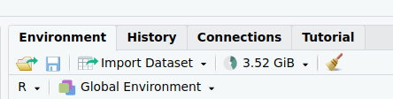
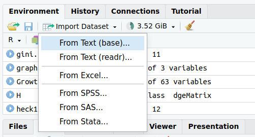
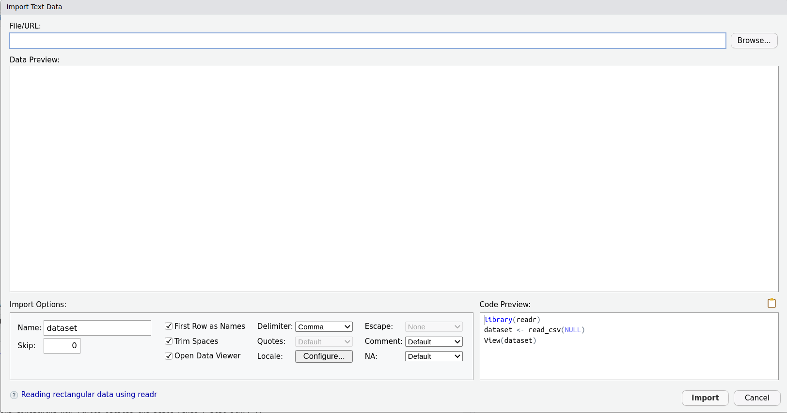
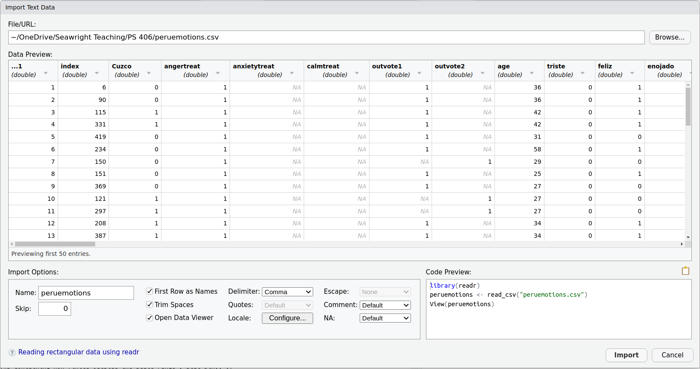
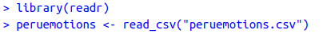

class: center, middle

```{css, echo=FALSE}
pre {
  max-height: 400px;
  overflow-y: auto;
}

pre[class] {
  max-height: 200px;
}
```

```{css, echo=FALSE}
.scroll-100 {
  max-height: 100px;
  overflow-y: auto;
  background-color: inherit;
}
```

```{r, load_refs, include=FALSE, cache=FALSE}
# Initializes the bibliography
library(RefManageR)

library(ggplot2)
library(dplyr)
library(readr)
library(nlme)
library(jtools)
library(hrbrthemes)
library(mice)
library(knitr)
options(warn=-1)

BibOptions(check.entries = FALSE,
           bib.style = "authoryear", # Bibliography style
           max.names = 3, # Max author names displayed in bibliography
           sorting = "nyt", #Name, year, title sorting
           cite.style = "authoryear", # citation style
           style = "markdown",
           hyperlink = FALSE,
           dashed = FALSE)
#myBib <- ReadBib("assets/myBib.bib", check = FALSE)
# Note: don't forget to clear the knitr cache to account for changes in the
# bibliography.
```
```{r xaringan-themer, include=FALSE, warning=FALSE}
library(xaringanthemer,MnSymbol)
style_mono_accent(
  base_color = "#1c5253",
  header_font_google = google_font("Josefin Sans"),
  text_font_google   = google_font("Montserrat", "300", "300i"),
  code_font_google   = google_font("Fira Mono"),
  text_font_size = "1.3rem"
)
```

---
### The Goals of R

-   R is a data science tool

-   Data science is about turning large amounts of structured but hard
    to understand data into smaller, easier to understand pieces of
    information

-   People these days may also use Python or STATA for the same goals

---
### The Grammar of R

-   Verb(Nouns, Adjectives)

-   The verb is a function, such as sum or median

-   The nouns are usually variables

-   The adjectives might be variables or instructions given as commands
    in quotation marks


---
### When Trouble Happens

-   Check spelling

-   Check for upper vs. lower case

-   Check your parentheses

-   Google your error message

-   Check the book, <https://www.statmethods.net/>, stackoverflow, or
    <https://www.reddit.com/r/Rlanguage/> for advice on the specific
    thing you're working on

---
### When Trouble Happens

-   Try three different things to fix your problem --- and if that
    doesn't work, stop and get help from me and/or a TA.

---
### Loading Data

---
```{r, echo = FALSE, out.width="100%", fig.retina = 1, fig.align='center'}

```

---
```{r, echo = FALSE, out.width="100%", fig.retina = 1, fig.align='center'}

```

---
```{r, echo = FALSE, out.width="100%", fig.retina = 1, fig.align='center'}

```

---
```{r, echo = FALSE, out.width="100%", fig.retina = 1, fig.align='center'}

```

---
```{r, echo = FALSE, out.width="100%", fig.retina = 1, fig.align='center'}

```

---
```{r, echo = TRUE, out.width="100%", fig.retina = 1, fig.align='center'}
library(readr)
peruemotions <- read_csv("peruemotions.csv")
head(peruemotions)
```

---
### Properties of Data Frames

-   dim()

-   names()

---
```{r, echo = TRUE, out.width="100%", fig.retina = 1, fig.align='center'}
dim(peruemotions)
names(peruemotions)
```

---
### Types of Variables

-   numeric

-   text

-   factor

---
```{r, echo = TRUE, out.width="100%", fig.retina = 1, fig.align='center'}
class(peruemotions$age)

peruemotions$age
```

---
```{r, echo = TRUE, out.width="100%", fig.retina = 1, fig.align='center'}
class(peruemotions$treatment)

peruemotions$treatment
```

---
```{r, echo = TRUE, out.width="100%", fig.retina = 1, fig.align='center'}
peruemotions$treatment <- as.factor(peruemotions$treatment)
class(peruemotions$treatment)
peruemotions$treatment
```

---
### Indexing

-   For a variable:

        sunlight$hours[534]

-   For a data frame:

        sunlight[12,534]

---
```{r, echo = TRUE, out.width="100%", fig.retina = 1, fig.align='center'}
peruemotions$age[50]

peruemotions[6,45]
```

---
### Does Internet Use Affect Democracy?

---
```{r, echo = TRUE, out.width="100%", fig.retina = 1, fig.align='center'}
library(devtools)
if (!require(rqog)){
  install_github("ropengov/rqog")}
library(rqog)
```

---
```{r, echo = TRUE, out.width="100%", fig.retina = 1, fig.align='center'}
qualityofgovernment <- read_qog(which_data="basic", data_type = "time-series")
dim(qualityofgovernment)
```
---
```{r, echo = TRUE, out.width="100%", fig.retina = 1, fig.align='center'}
names(qualityofgovernment)[1:30]
```

---
```{r, echo = TRUE, out.width="100%", fig.retina = 1, fig.align='center'}
summary(qualityofgovernment$wdi_internet)

summary(qualityofgovernment$p_polity2)
```

---
```{r, echo = TRUE, out.width="100%", fig.retina = 1, fig.align='center'}
internet_democracy_plot <- qualityofgovernment %>% ggplot(aes(x=wdi_internet, y=p_polity2)) + 
    geom_jitter()
```

---
```{r, echo = FALSE, out.width="60%", fig.retina = 1, fig.align='center'}
internet_democracy_plot
```

---
```{r, echo = TRUE, out.width="100%", fig.retina = 1, fig.align='center'}
table(qualityofgovernment$year,qualityofgovernment$wdi_internet==0)
```

---
```{r, echo = TRUE, out.width="100%", fig.retina = 1, fig.align='center'}
internet_democracy_plot <- qualityofgovernment %>% filter(year>1991) %>%
    ggplot(aes(x=wdi_internet, y=p_polity2)) + 
    geom_jitter()
```

---
```{r, echo = FALSE, out.width="60%", fig.retina = 1, fig.align='center'}
  internet_democracy_plot
```

---
```{r, echo = TRUE, out.width="100%", fig.retina = 1, fig.align='center'}
internet_democracy_plot_lm <- qualityofgovernment %>% filter(year>1991) %>%
    ggplot(aes(x=wdi_internet, y=p_polity2)) + 
    geom_jitter() +
    geom_smooth(method=lm , color="red", fill="#69b3a2", se=TRUE)
```

---
```{r, echo = FALSE, out.width="60%", fig.retina = 1, fig.align='center'}
 internet_democracy_plot_lm 
```

---
```{r, echo = TRUE, out.width="100%", fig.retina = 1, fig.align='center'}
table(qualityofgovernment$cname[is.na(qualityofgovernment$wdi_internet[qualityofgovernment$year>1991])])
```
---
```{r, echo = TRUE, out.width="100%", fig.retina = 1, fig.align='center'}
table(qualityofgovernment$cname[is.na(qualityofgovernment$p_polity2[qualityofgovernment$year>1991])])
```

---
```{r, echo = TRUE, out.width="100%", fig.retina = 1, fig.align='center'}
summary(qualityofgovernment$wdi_gdpcappppcon2017)
```

---
```{r, echo = TRUE, out.width="100%", fig.retina = 1, fig.align='center'}
internet_wealth_plot <- qualityofgovernment %>% filter(year>1991) %>%
    ggplot(aes(x=wdi_gdpcappppcon2017, y=wdi_internet)) + 
    geom_point() +
    geom_smooth(method=lm , color="red", fill="#69b3a2", se=TRUE)
```

---
```{r, echo = FALSE, out.width="60%", fig.retina = 1, fig.align='center'}

  internet_wealth_plot

```


---
```{r, echo = TRUE, out.width="100%", fig.retina = 1, fig.align='center'}
dem_wealth_plot <- qualityofgovernment %>% filter(year>1991) %>%
    ggplot(aes(x=wdi_gdpcappppcon2017, y=p_polity2)) + 
    geom_jitter() +
    geom_smooth(method=lm , color="red", fill="#69b3a2", se=TRUE)
```

---
```{r, echo = FALSE, out.width="60%", fig.retina = 1, fig.align='center'}

  dem_wealth_plot

```


---
```{r, echo = TRUE, out.width="100%", fig.retina = 1, fig.align='center'}
library(jtools)
```

---
```{r, echo = TRUE, out.width="100%", fig.retina = 1, fig.align='center'}
summ(lm(p_polity2 ~ wdi_internet + wdi_gdpcappppcon2017, data=qualityofgovernment))
```

---
```{r, echo = TRUE, out.width="100%", fig.retina = 1, fig.align='center'}
summ(lm(p_polity2 ~ wdi_internet + I(log(wdi_gdpcappppcon2017)), data=qualityofgovernment))
```
