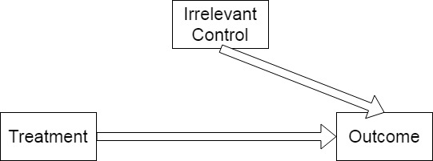
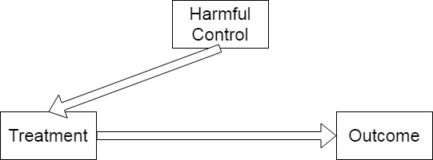
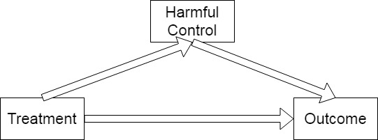

class: center, middle

```{css, echo=FALSE}
pre {
  max-height: 400px;
  overflow-y: auto;
}

pre[class] {
  max-height: 200px;
}
```

```{r, load_refs, include=FALSE, cache=FALSE}
# Initializes the bibliography
library(RefManageR)

library(ggplot2)
library(dplyr)
library(readr)
library(nlme)
library(jtools)
library(hrbrthemes)
library(mice)

BibOptions(check.entries = FALSE,
           bib.style = "authoryear", # Bibliography style
           max.names = 3, # Max author names displayed in bibliography
           sorting = "nyt", #Name, year, title sorting
           cite.style = "authoryear", # citation style
           style = "markdown",
           hyperlink = FALSE,
           dashed = FALSE)
#myBib <- ReadBib("assets/myBib.bib", check = FALSE)
# Note: don't forget to clear the knitr cache to account for changes in the
# bibliography.
```
```{r xaringan-themer, include=FALSE, warning=FALSE}
library(xaringanthemer,MnSymbol)
style_mono_accent(
  base_color = "#1c5253",
  header_font_google = google_font("Josefin Sans"),
  text_font_google   = google_font("Montserrat", "300", "300i"),
  code_font_google   = google_font("Fira Mono"),
  text_font_size = "1.6rem"
)
```

---
### Office Hours

-   Jason Seawright: Tuesdays and Thursdays, 4-5pm.

---
### Online Survey

Please take a moment to complete [this survey](https://weinberg.co1.qualtrics.com/jfe/form/SV_0VRUVWtG8jMJTts). Results will only be used for this class and will be deleted this evening.

---
### Potential Outcomes

-   Let's build a model of one person participating in the experiment.

---
### Potential Outcomes

-   Suppose we name that person $i$.

-   The person we're interested in says not extreme when in the control
    group, and extreme when in the treatment group.

---
### Potential Outcomes

-   $y_{i,c} = 0$

-   $y_{i,t} = 1$

---
### The Potential Outcomes Framework

-   We are interested in the effects of a dichotomous treatment (i.e.,
    independent variable): whether person got the treatment (t) or the
    control (c).

-   This variable can be written as $W_{i} = (t,c)$.

---
### The Potential Outcomes Framework

-   For a given case, $i$, we either observe $W_{i} = t$ or $W_{i} = c$.
    If $W_{i} = t$, let us denote the value of the dependent variable as
    $y_{i,t}$. If $W_{i} = c$, let us denote the value of the dependent
    variable as $y_{i,c}$

---
### The Potential Outcomes Framework

-   The causal effect of $W$ on $y$ is:

    -   $y_{i,t} - y_{i,c}$

---
### The Average Treatment Effect

-   Sometimes, we are interested in developing an estimate of the effect
    of $W$ on $y$ in some population $\Pi$, from which we have a random
    sample (or even the whole population) split randomly into treatment
    and control cases.

-   Here, interest focuses on the "average treatment effect":

    -   $E(y_{i,t}) - E(y_{i,c})$

---
### Experiments and Causal Inference

-   When our treatment is randomly assigned, the set of cases where
    $W_{i} = t$ produces a random sample from the population of $y_{t}$.
    Likewise, the set of cases where $W_{i} = c$ produces a random
    sample from the population of $y_{c}$. Thus:

    -   $E_{t}(y_{i,t}) = E(y_{i,t})$

    -   $E_{c}(y_{i,c}) = E(y_{i,c})$

    -   $E(y_{i,t}) - E(y_{i,c}) = E_{t}(y_{i,t}) - E_{c}(y_{i,c})$

---
### The Four Questions

1.  Is there a relationship between $X$ and $Y$?

2.  Could $Y$ cause $X$?

3.  Is there a pathway linking $X$ and $Y$?

4.  Are there *confounding variables*?

---
### Controlling for Confounders

**Controlling for a confounder** is choosing a set of cases that all
have the same score on the confounding variable and looking at the
relationship between the IV and the DV in only those cases.

---
### Problems with Controlling for Confounders

-   You can only control for variables that you actually think of
    controlling for.

-   If you control for too many variables, you may not have very many
    cases left in each category.

-   Post-treatment controls create bias.


---


---


---


---


---


---
### Is Salt Bad for You?

---


---
```{r, echo = TRUE, out.width="90%", fig.retina = 1}
library(devtools)
#install_github("ropengov/rqog")
library(rqog)
```

---
```{r, echo = TRUE, out.width="100%", fig.retina = 1, fig.align='center'}
qualityofgovernment <- read_qog(which_data="standard", data_type = "time-series")

qogdems2000 <- qualityofgovernment %>% 
  filter(year==2000 & vdem_libdem > 0.7)

qog2000demsin2020 <- qualityofgovernment %>% 
  filter(year==2020 & cname %in% qogdems2000$cname)
```

---
```{r, echo = TRUE, out.width="60%", fig.retina = 1}
pres_dem_violin <- qog2000demsin2020 %>% ggplot(aes(x=as.factor(br_pres), y=vdem_libdem)) + 
  geom_violin()

pres_dem_violin
```
