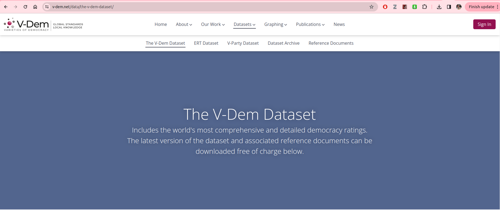
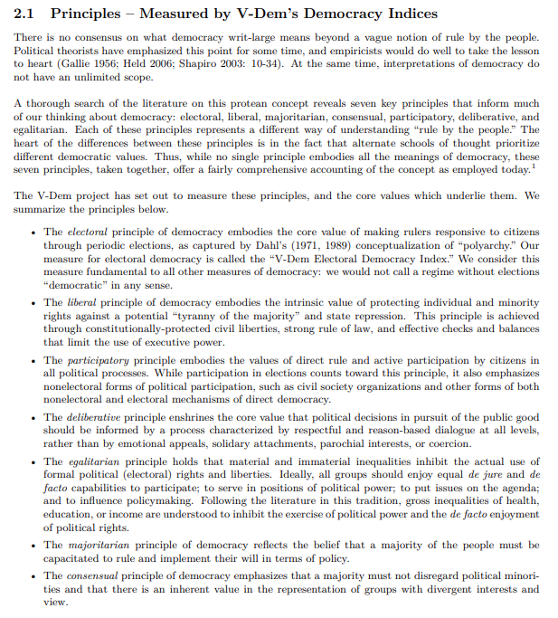
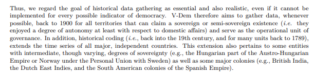
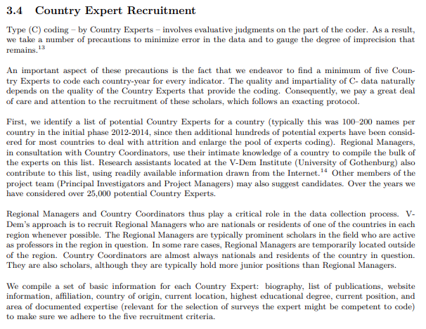

class: center, middle

```{css, echo=FALSE}
pre {
  max-height: 400px;
  overflow-y: auto;
}

pre[class] {
  max-height: 200px;
}
```

```{r, load_refs, include=FALSE, cache=FALSE}
# Initializes the bibliography
library(RefManageR)

library(ggplot2)
library(dplyr)
library(readr)
library(nlme)
library(jtools)
library(ggthemes)
library(mice)

BibOptions(check.entries = FALSE,
           bib.style = "authoryear", # Bibliography style
           max.names = 3, # Max author names displayed in bibliography
           sorting = "nyt", #Name, year, title sorting
           cite.style = "authoryear", # citation style
           style = "markdown",
           hyperlink = FALSE,
           dashed = FALSE)
#myBib <- ReadBib("assets/myBib.bib", check = FALSE)
# Note: don't forget to clear the knitr cache to account for changes in the
# bibliography.
```
```{r xaringan-themer, include=FALSE, warning=FALSE}
library(xaringanthemer,MnSymbol)
style_mono_accent(
  base_color = "#1c5253",
  header_font_google = google_font("Josefin Sans"),
  text_font_google   = google_font("Montserrat", "300", "300i"),
  code_font_google   = google_font("Fira Mono"),
  text_font_size = "1.6rem"
)
```

---
### What are Some Really Unusual Ideas About Society/Politics that are Going Around?

---
[For example...](https://trends.google.com/trends/explore?date=today%205-y&q=%2Fg%2F11hk3_sx0c,%2Fm%2F0174w5,%2Fm%2F052bk3,%2Fg%2F11c3w6djhb&hl=en)

---
```{r, echo = TRUE, out.width="90%", fig.retina = 1}
unusualideas <- read_csv("unusualideas.csv")
head(unusualideas)
```

---
```{r, echo = TRUE, out.width="90%", fig.retina = 1}
summary(unusualideas)
```

---
```{r, echo = TRUE, out.width="90%", fig.retina = 1}
standardized_ideas <- data.frame(week = 1:nrow(unusualideas), scale(unusualideas[,2:5]))
```

---
```{r, echo = TRUE, out.width="60%", fig.retina = 1}
cricketcity.plot <- standardized_ideas %>% ggplot(aes(x=fifteenminutecity, y=cricketflour)) +
  geom_jitter() +
  geom_smooth(method=lm , color="red", fill="#69b3a2", se=TRUE) +
  theme_tufte()
```
---
```{r, echo = TRUE, out.width="60%", fig.retina = 1}
cricketcity.plot
```

---
```{r, echo = TRUE, out.width="60%", fig.retina = 1}
wefcity.plot <- standardized_ideas %>% ggplot(aes(x=fifteenminutecity, y=worldeconomicforum)) +
  geom_jitter() +
  geom_smooth(method=lm , color="red", fill="#69b3a2", se=TRUE) +
  theme_tufte() 
```
---
```{r, echo = TRUE, out.width="60%", fig.retina = 1}
wefcity.plot
```

---
```{r, echo = TRUE, out.width="60%", fig.retina = 1}
cricketwef.plot <- standardized_ideas %>% ggplot(aes(x=worldeconomicforum, y=cricketflour)) +
  geom_jitter() +
  geom_smooth(method=lm , color="red", fill="#69b3a2", se=TRUE) +
  theme_tufte() 
```
---
```{r, echo = TRUE, out.width="60%", fig.retina = 1}
cricketwef.plot
```

---
```{r, echo = TRUE, out.width="60%", fig.retina = 1}
schwabwef.plot <- standardized_ideas %>% ggplot(aes(x=worldeconomicforum, y=klausschwab)) +
  geom_jitter() +
  geom_smooth(method=lm , color="red", fill="#69b3a2", se=TRUE) +
  theme_tufte() 
```
---
```{r, echo = TRUE, out.width="60%", fig.retina = 1}
schwabwef.plot
```

---
### Using Existing Data

1. We can't always get what we want!

2. Some projects will end up being defined by data availability.

3. Projects will typically end up being shaped in some ways by what we can get, when we don't have time/resources to create our own data.

---
### Where can you find data?

-   Harvard Dataverse

-   kaggle.com

-   Google Scholar

-   Famous existing datasets (QoG, COW, ANES, WVS)

-   Github repositories

---
### Evaluating Existing Data

1. Can you get access to the raw data?

2. Does the project include all of the variables you're likely to be interested in?

3. Is the sampling approach well documented, and does it fit your project?

4. Is the measurement approach well documented and high quality?

---
### Example: Measuring Democracy

```{r, echo = FALSE, out.width="100%", fig.retina = 1, fig.align='center'}
library(knitr)

```

---
```{r, echo = FALSE, out.width="100%", fig.retina = 1, fig.align='center'}

```

---
```{r, echo = FALSE, out.width="100%", fig.retina = 1, fig.align='center'}

```

---
```{r, echo = FALSE, out.width="100%", fig.retina = 1, fig.align='center'}

```

---
```{r, echo = TRUE, out.width="100%", fig.retina = 1, fig.align='center'}
library(devtools)
#devtools::install_github("vdeminstitute/vdemdata")
library(vdemdata)
```

---
```{r, echo = TRUE, out.width="70%", fig.retina = 1, fig.align='center'}
vdem2024 <- vdem

plot_indicator("v2x_libdem")
```

---
```{r, echo = TRUE, out.width="70%", fig.retina = 1, fig.align='center'}
names(vdem)[1:50]
```
