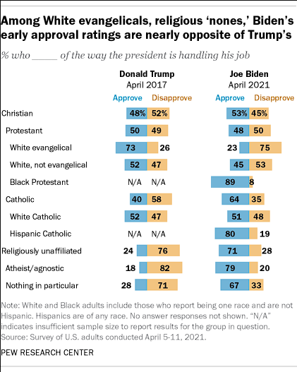
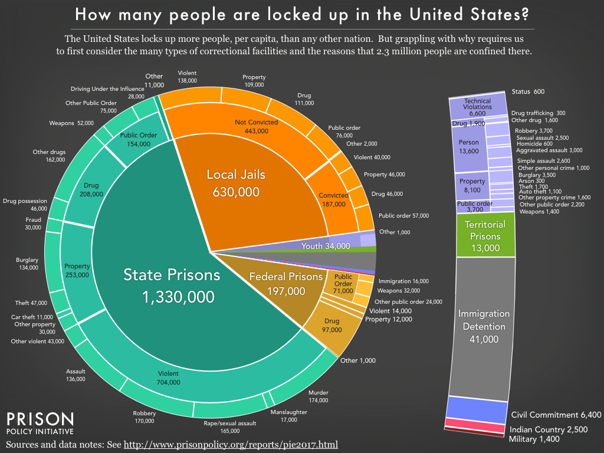
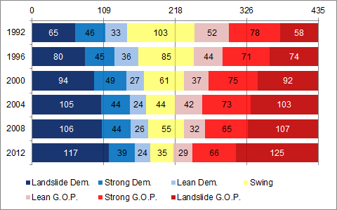

class: center, middle

```{css, echo=FALSE}
pre {
  max-height: 400px;
  overflow-y: auto;
}

pre[class] {
  max-height: 200px;
}
```

```{css, echo=FALSE}
.scroll-100 {
  max-height: 100px;
  overflow-y: auto;
  background-color: inherit;
}
```

```{r, load_refs, include=FALSE, cache=FALSE}
# Initializes the bibliography
library(RefManageR)

library(ggplot2)
library(dplyr)
library(readr)
library(nlme)
library(jtools)
library(hrbrthemes)
library(mice)
options(warn=-1)

BibOptions(check.entries = FALSE,
           bib.style = "authoryear", # Bibliography style
           max.names = 3, # Max author names displayed in bibliography
           sorting = "nyt", #Name, year, title sorting
           cite.style = "authoryear", # citation style
           style = "markdown",
           hyperlink = FALSE,
           dashed = FALSE)
#myBib <- ReadBib("assets/myBib.bib", check = FALSE)
# Note: don't forget to clear the knitr cache to account for changes in the
# bibliography.
```
```{r xaringan-themer, include=FALSE, warning=FALSE}
library(xaringanthemer,MnSymbol)
style_mono_accent(
  base_color = "#1c5253",
  header_font_google = google_font("Josefin Sans"),
  text_font_google   = google_font("Montserrat", "300", "300i"),
  code_font_google   = google_font("Fira Mono"),
  text_font_size = "1.3rem"
)
```

---
```{r, echo = TRUE, out.width="100%", fig.retina = 1, fig.align='center'}
peruemotions <- read.csv("https://raw.githubusercontent.com/jnseawright/PS406/main/data/peruemotions.csv")

library(jtools)
```

---
```{r, echo = TRUE, out.width="100%", fig.retina = 1, fig.align='center'}
summ(lm(outsidervote ~ simpletreat + risk, data=peruemotions))
```

---

A good analysis not only gives the reader a clear sense of what variables **mean** and where they **come from**, but also how they are **scaled,** **distributed,** and **interrelated.** 

---
### Kinds of Variables

-   Qualitative

-   Quantitative

---
```{r, echo = TRUE, out.width="100%", fig.retina = 1, fig.align='center'}

library(kableExtra)
        
kbl(table(peruemotions$treatment), format="pipe")

```

---
```{r, echo = TRUE, out.width="100%", fig.retina = 1, fig.align='center'}

kbl(table(peruemotions$age), format="pipe")

```

---
### Kinds of Qualitative Variables

-   Dichotomy

-   Nominal

-   Ordinal

---
```{r, echo = TRUE, out.width="100%", fig.retina = 1, fig.align='center'}

kbl(table(peruemotions$outsidervote), format="pipe")

```

---
```{r, echo = TRUE, out.width="100%", fig.retina = 1, fig.align='center'}

kbl(table(peruemotions$partyid), format="pipe")

```

---
```{r, echo = TRUE, out.width="100%", fig.retina = 1, fig.align='center'}

kbl(table(peruemotions$edlevel), format="pipe")

```


---
### Kinds of Quantitative Variables

-   Interval

-   Ratio

---
### Describing a Dichotomy

-   Just report the percentage

---


---
### Describing a Nominal Variable

-   Pie Chart (?)

-   Bar Chart

-   Line Chart

---


---


---

[The R Graph Gallery](https://r-graph-gallery.com/)

[R Charts](https://r-charts.com/)

[R Cookbook Graphs Section](http://www.cookbook-r.com/Graphs/)

---

Our main goal in describing data is to determine the magnitude of a plausible change in each variable.

---
### Does the internet help or hurt democracy?

---
```{r, echo = TRUE, out.width="100%", fig.retina = 1, fig.align='center'}
library(devtools)
#install_github("ropengov/rqog")
library(rqog)
```

---
```{r, echo = TRUE, out.width="100%", fig.retina = 1, fig.align='center'}
qualityofgovernment <- read_qog(which_data="basic", data_type = "time-series")
```

---
```{r, echo = TRUE, out.width="100%", fig.retina = 1, fig.align='center'}
summ(lm(p_polity2 ~ wdi_internet + I(log(wdi_gdpcappppcon2017)), data=qualityofgovernment))
```


---
```{r, echo = TRUE, out.width="100%", fig.retina = 1, fig.align='center'}
summ(lm(p_polity2 ~ wdi_internet + I(log(wdi_gdpcappppcon2017)), data=qualityofgovernment))
```

---
```{r, echo = TRUE, out.width="100%", fig.retina = 1, fig.align='center'}
library(psych)
describe(qualityofgovernment$p_polity2)
```

---
```{r, echo = TRUE, out.width="100%", fig.retina = 1, fig.align='center'}
describe(qualityofgovernment$wdi_internet)
```

---
```{r, echo = TRUE, out.width="100%", fig.retina = 1, fig.align='center'}
describe(log(qualityofgovernment$wdi_gdpcappppcon2017))
```