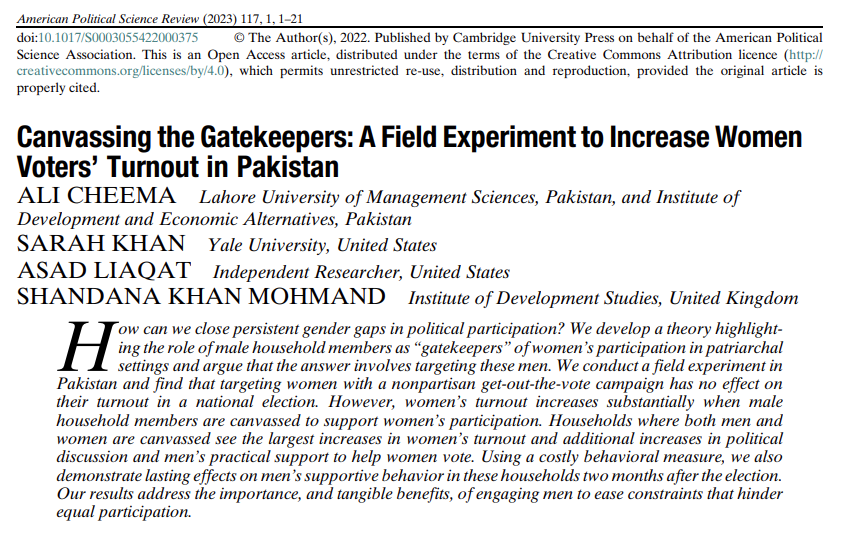
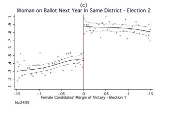
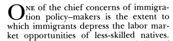
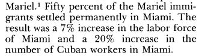
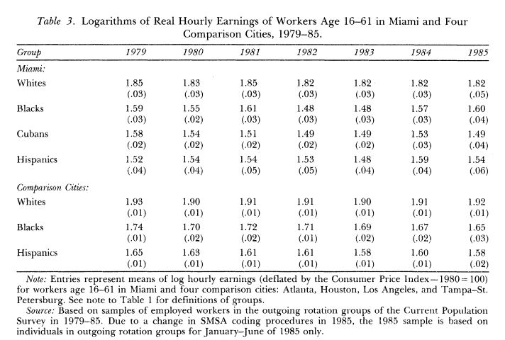
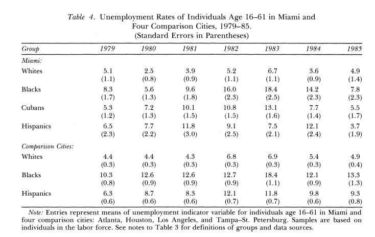
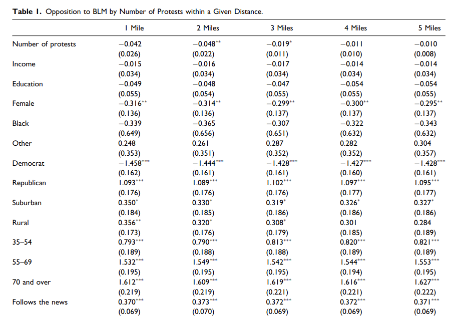

class: center, middle

```{css, echo=FALSE}
pre {
  max-height: 400px;
  overflow-y: auto;
}

pre[class] {
  max-height: 200px;
}
```

```{css, echo=FALSE}
.scroll-100 {
  max-height: 100px;
  overflow-y: auto;
  background-color: inherit;
}
```

```{r, load_refs, include=FALSE, cache=FALSE}
# Initializes the bibliography
library(RefManageR)

library(ggplot2)
library(dplyr)
library(readr)
library(nlme)
library(jtools)
library(hrbrthemes)
library(mice)
options(warn=-1)

BibOptions(check.entries = FALSE,
           bib.style = "authoryear", # Bibliography style
           max.names = 3, # Max author names displayed in bibliography
           sorting = "nyt", #Name, year, title sorting
           cite.style = "authoryear", # citation style
           style = "markdown",
           hyperlink = FALSE,
           dashed = FALSE)
#myBib <- ReadBib("assets/myBib.bib", check = FALSE)
# Note: don't forget to clear the knitr cache to account for changes in the
# bibliography.
```
```{r xaringan-themer, include=FALSE, warning=FALSE}
library(xaringanthemer,MnSymbol)
style_mono_accent(
  base_color = "#1c5253",
  header_font_google = google_font("Josefin Sans"),
  text_font_google   = google_font("Montserrat", "300", "300i"),
  code_font_google   = google_font("Fira Mono"),
  text_font_size = "1.3rem"
)
```

---

A quantitative study in the social sciences is defined by its *style of data* combined with its *strategy for causal inference.*

---
### Styles of Data

-   Survey

-   Text

-   Secondary statistics

-   Sometimes measured behavior

-   A few other options

---
### Strategies for Causal Inference

-   Experiment

-   Natural experiment

-   Regression-discontinuity design

-   Difference-in-differences design

-   Control variables

-   A few other options

---
### Survey Data

Based on hundreds or (ideally) thousands of structured conversations with randomly (or as-if randomly) selected members of the population of interest.

---
### Survey Data

While there is a voluminous literature about how to ask survey questions optimally, the available empirical evidence suggests that precise wording and ordering of survey questions usually matters less than getting the sample right.

---
```{r, echo = FALSE, out.width="100%", fig.retina = 1, fig.align='center'}
library(knitr)

```

---
```{r, echo = FALSE, out.width="100%", fig.retina = 1, fig.align='center'}

```

---
```{r, echo = FALSE, out.width="100%", fig.retina = 1, fig.align='center'}

```

---
```{r, echo = FALSE, out.width="100%", fig.retina = 1, fig.align='center'}

```

---
```{r, echo = FALSE, out.width="100%", fig.retina = 1, fig.align='center'}

```

---
```{r, echo = FALSE, out.width="100%", fig.retina = 1, fig.align='center'}

```

---
### Text Data

Based on capturing large sets of comparable texts on a topic of interest, either from different actors or from the same actors over time, and then coding them to see how they vary, and in which ways they are similar.

---
### Text Data

The coding can be done by hand, or by computer.

---
```{r, echo = FALSE, out.width="100%", fig.retina = 1, fig.align='center'}

```

---
```{r, echo = FALSE, out.width="100%", fig.retina = 1, fig.align='center'}

```

---
```{r, echo = FALSE, out.width="100%", fig.retina = 1, fig.align='center'}

```

---
```{r, echo = FALSE, out.width="100%", fig.retina = 1, fig.align='center'}

```

---
```{r, echo = FALSE, out.width="100%", fig.retina = 1, fig.align='center'}

```

---
```{r, echo = FALSE, out.width="100%", fig.retina = 1, fig.align='center'}

```

---
### Secondary statistics

Secondary statistics are data published for some other reason, or records that exist independently that we are free to analyze.

---
### Secondary statistics

Examples include census records, election results, stock market performance, sports scores, weather reports, crime reports, etc.

---
```{r, echo = FALSE, out.width="100%", fig.retina = 1, fig.align='center'}

```

---
```{r, echo = FALSE, out.width="100%", fig.retina = 1, fig.align='center'}

```

---
```{r, echo = FALSE, out.width="100%", fig.retina = 1, fig.align='center'}

```

---
### Measured Behavior

Sometimes we can create a situation where we can directly observe and code how people act.

---
```{r, echo = FALSE, out.width="100%", fig.retina = 1, fig.align='center'}

```

---
```{r, echo = FALSE, out.width="100%", fig.retina = 1, fig.align='center'}

```

---
```{r, echo = FALSE, out.width="80%", fig.retina = 1, fig.align='center'}

```

---
```{r, echo = FALSE, out.width="80%", fig.retina = 1, fig.align='center'}

```

---
### Experiments

---
```{r, echo = TRUE, out.width="100%", fig.retina = 1}
library(dagitty)
experiment.graph <- dagitty( "dag {
     W1 -> Z1 -> X -> Y
     Z1 <- RandomIntervention -> Z2
     W2 -> Z2 -> Y
     X <-> W1 <-> W2 <-> Y
 }")
```

---
```{r, echo = TRUE, out.width="80%", fig.retina = 1}
plot(graphLayout(experiment.graph))
```

---
```{r, echo = FALSE, out.width="100%", fig.retina = 1}

```

---
```{r, echo = FALSE, out.width="100%", fig.retina = 1}
include_graphics("images/Cheema2.png")
```

---
```{r, echo = FALSE, out.width="100%", fig.retina = 1}
include_graphics("images/Cheema3.png")
```

---
```{r, echo = FALSE, out.width="100%", fig.retina = 1}
include_graphics("images/Cheema4.png")
```

---
### Natural Experiments

---
```{r, echo = TRUE, out.width="100%", fig.retina = 1}
library(dagitty)
naturalexperiment.graph <- dagitty( "dag {
     W1 -> Z1 -> X -> Y
     Z1 <- RandomEvent -> Z2
     W2 -> Z2 -> Y
     X <-> W1 <-> W2 <-> Y
 }")
```

---
```{r, echo = FALSE, out.width="80%", fig.retina = 1}
plot(graphLayout(naturalexperiment.graph))
```

---
### Vietnam War Draft Lottery

---
```{r, echo = FALSE, out.width="85%", fig.retina = 1, fig.align='center'}
include_graphics("images/angrist.JPG")
```

---
```{r, echo = FALSE, out.width="100%", fig.retina = 1, fig.align='center'}
include_graphics("images/draftrandom.JPG")
```

---
```{r, echo = TRUE, out.width="100%", fig.retina = 1, fig.align='center'}
draft1970 <- read_csv("draft1970.csv")
```
---
```{r, echo = TRUE, out.width="70%", fig.retina = 1, fig.align='center'}
boxplot(rank~month, data=draft1970)
```

---
```{r, echo = TRUE, out.width="100%", fig.retina = 1, fig.align='center'}
draftlm <- lm(rank ~ day, data=draft1970)
```
---
```{r, echo = TRUE, out.width="100%", fig.retina = 1, fig.align='center'}
summ(draftlm)
```
---
```{r, echo = TRUE, out.width="100%", fig.retina = 1, fig.align='center'}
draft1971 <- read_csv("draft1971.csv")
```
---
```{r, echo = TRUE, out.width="70%", fig.retina = 1, fig.align='center'}
boxplot(rank~month, data=draft1971)
```

---
```{r, echo = TRUE, out.width="100%", fig.retina = 1, fig.align='center'}
draft71lm <- lm(rank ~ day, data=draft1971)
```
---
```{r, echo = TRUE, out.width="100%", fig.retina = 1, fig.align='center'}
summ(draft71lm)
```

---
### Regression Discontinuity Design

---
```{r, echo = TRUE, out.width="100%", fig.retina = 1}
library(dagitty)
rdd.graph <- dagitty( "dag {
     Z -> AssignmentRule -> X -> Y
 }")
```

---
```{r, echo = FALSE, out.width="80%", fig.retina = 1}
plot(graphLayout(rdd.graph))
```

---
```{r, echo = FALSE, out.width="65%", fig.retina = 1, fig.align='center'}
include_graphics("images/Broockman.JPG")
```

---
```{r, echo = FALSE, out.width="65%", fig.retina = 1, fig.align='center'}
include_graphics("images/BroockmanRDDVisual.JPG")
```

---
```{r, echo = FALSE, out.width="65%", fig.retina = 1, fig.align='center'}

```

---
```{r, echo = FALSE, out.width="65%", fig.retina = 1, fig.align='center'}
include_graphics("images/BroockmanFailure.JPG")
```

---
### Difference-in-Differences

---
```{r, echo = TRUE, out.width="100%", fig.retina = 1}
library(dagitty)
diffindiff.graph <- dagitty( "dag {
     W1 -> Z1 -> ChangeinX -> ChangeinY
     Z1 <- Z3 -> Z2
     W2 -> Z2 -> Y
     X <-> W1 <-> W2 <-> Y
     X -> Y
 }")
```

---
```{r, echo = FALSE, out.width="80%", fig.retina = 1}
plot(graphLayout(diffindiff.graph))
```

---
```{r, echo = FALSE, out.width="90%", fig.retina = 1, fig.align='center'}
include_graphics("images/miamiboatlift.JPG")
```

---
```{r, echo = FALSE, out.width="90%", fig.retina = 1, fig.align='center'}

```

---
```{r, echo = FALSE, out.width="90%", fig.retina = 1, fig.align='center'}

```

---
```{r, echo = FALSE, out.width="90%", fig.retina = 1, fig.align='center'}

```

---
```{r, echo = FALSE, out.width="90%", fig.retina = 1, fig.align='center'}

```

---
```{r, echo = FALSE, out.width="90%", fig.retina = 1, fig.align='center'}
include_graphics("images/marielconclusions.JPG")
```

---
### Control Variables

---
```{r, echo = TRUE, out.width="100%", fig.retina = 1}
library(dagitty)
controls.graph <- dagitty( "dag {
     W1 -> Z1 -> X -> Y
     Z1 <- Z3 -> Z2
     W2 -> Z2 -> Y
     X <-> W1 <-> W2 <-> Y
 }")
```

---
```{r, echo = FALSE, out.width="80%", fig.retina = 1}
plot(graphLayout(controls.graph))
```

---
```{r, echo = FALSE, out.width="90%", fig.retina = 1, fig.align='center'}

```

---
```{r, echo = FALSE, out.width="90%", fig.retina = 1, fig.align='center'}

```

---
### Open Science Practices

---
```{r, echo = FALSE, out.width="90%", fig.retina = 1, fig.align='center'}
include_graphics("images/Christensen1.png")
```

---
### Posting Data and Code

-   Facilitates replication

-   Reduces opportunities for fraud

-   Increases opportunities for secondary analysis

-   Enhances the growth of knowledge

---
### Posting Study Instruments

-   Has most of the same advantages, but can be less immediately rewarding.

---
### Preregistration

-   Publishing hypotheses and intended statistical analysis before the data are collected (or sometimes before they are opened/analyzed)

-   Intended to reduce fraud and certain kinds of statistical manipulation

-   Increases transparency

---
```{r, echo = FALSE, out.width="90%", fig.retina = 1, fig.align='center'}
include_graphics("images/Schafer1.png")
```

---
```{r, echo = FALSE, out.width="90%", fig.retina = 1, fig.align='center'}

```