class: center, middle

```{css, echo=FALSE}
pre {
  max-height: 400px;
  overflow-y: auto;
}

pre[class] {
  max-height: 200px;
}
```

```{css, echo=FALSE}
.scroll-100 {
  max-height: 100px;
  overflow-y: auto;
  background-color: inherit;
}
```

```{r, load_refs, include=FALSE, cache=FALSE}
# Initializes the bibliography
library(RefManageR)

library(ggplot2)
library(dplyr)
library(readr)
library(nlme)
library(jtools)
library(hrbrthemes)
library(mice)
options(warn=-1)

BibOptions(check.entries = FALSE,
           bib.style = "authoryear", # Bibliography style
           max.names = 3, # Max author names displayed in bibliography
           sorting = "nyt", #Name, year, title sorting
           cite.style = "authoryear", # citation style
           style = "markdown",
           hyperlink = FALSE,
           dashed = FALSE)
#myBib <- ReadBib("assets/myBib.bib", check = FALSE)
# Note: don't forget to clear the knitr cache to account for changes in the
# bibliography.
```
```{r xaringan-themer, include=FALSE, warning=FALSE}
library(xaringanthemer,MnSymbol)
style_mono_accent(
  base_color = "#1c5253",
  header_font_google = google_font("Josefin Sans"),
  text_font_google   = google_font("Montserrat", "300", "300i"),
  code_font_google   = google_font("Fira Mono"),
  text_font_size = "1.3rem"
)
```

---

```{r, echo = FALSE, out.width="100%", fig.retina = 1, fig.align='center'}
library(knitr)
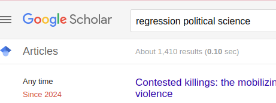
```

---

```{r, echo = FALSE, out.width="100%", fig.retina = 1, fig.align='center'}
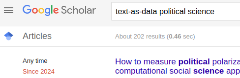
```

---

```{r, echo = FALSE, out.width="100%", fig.retina = 1, fig.align='center'}
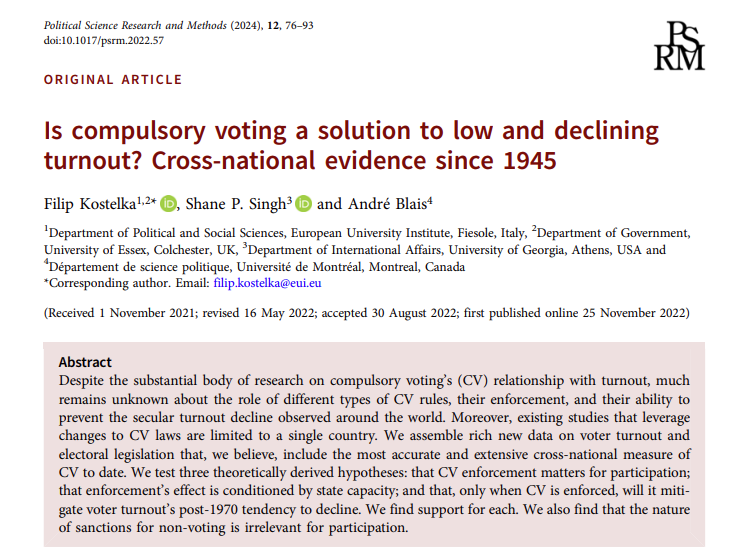
```

---

```{r, echo = FALSE, out.width="100%", fig.retina = 1, fig.align='center'}
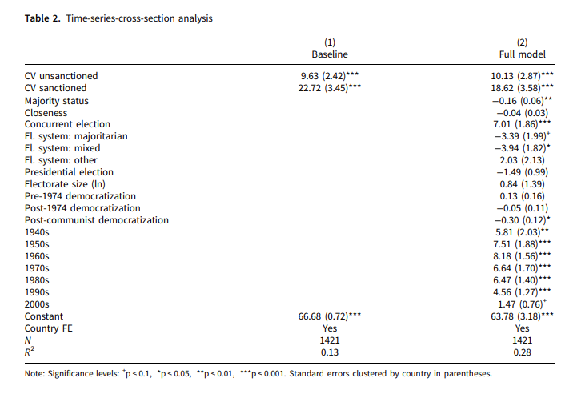
```

---

```{r, echo = FALSE, out.width="100%", fig.retina = 1, fig.align='center'}
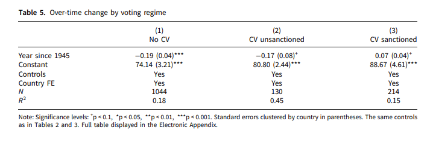
```

---

```{r, echo = FALSE, out.width="80%", fig.retina = 1, fig.align='center'}
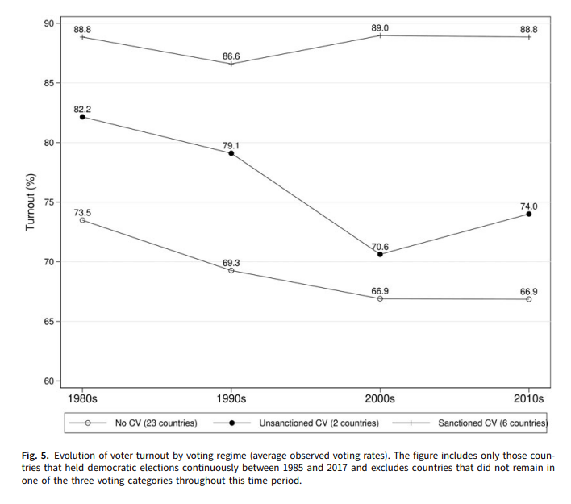
```

---

```{r, echo = FALSE, out.width="100%", fig.retina = 1, fig.align='center'}
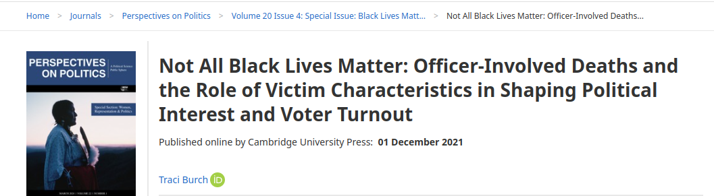
```

---

```{r, echo = FALSE, out.width="100%", fig.retina = 1, fig.align='center'}
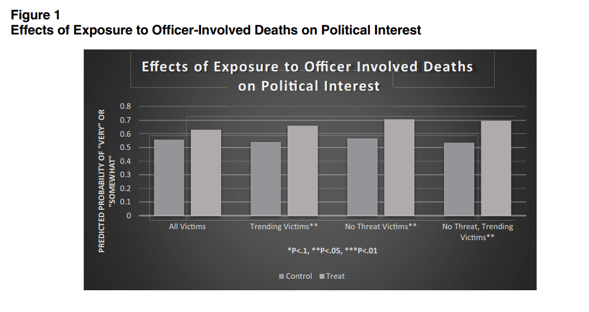
```

---

```{r, echo = FALSE, out.width="100%", fig.retina = 1, fig.align='center'}
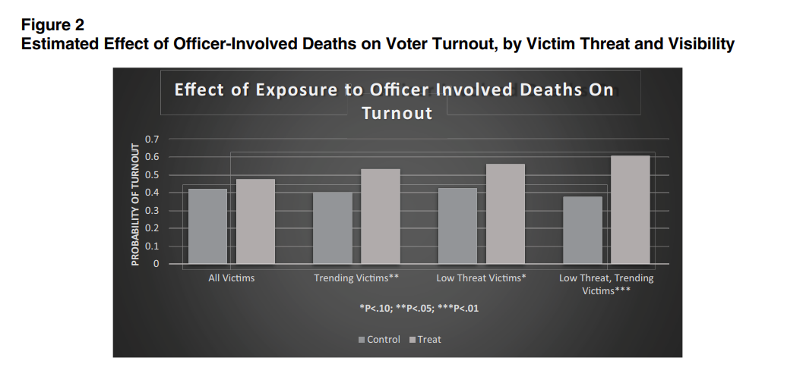
```

---

```{r, echo = FALSE, out.width="90%", fig.retina = 1, fig.align='center'}
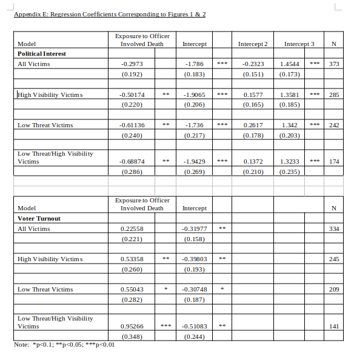
```


---
### Why?

- Regression (and similar tools) fits with a lot of research problems.

---
| | Survey        | Text          | Secondary Statistics  | Measured Behavior |
|-- |------------- |-------------| ---------------------|------------------|
| Experiment  |    |  |  | |
| Natural Experiment |       |       |    |  |
| RDD |  |       |     |   |
| Diff-in-diff |  |       |     |   |
| Control variables |  |      |     |   |

---

Where do we pretty much always *need* regression?

| | Survey        | Text          | Secondary Statistics  | Measured Behavior |
|-- |------------- |-------------| ---------------------|------------------|
| Experiment  |    |  |  | |
| Natural Experiment |       |       |    |  |
| RDD | XX |  XX | XX | XX  |
| Diff-in-diff | XX | XX | XX | XX |
| Control variables | XX |  XX    | XX    | XX  |

---

Where do we *usually* need regression?

| | Survey        | Text          | Secondary Statistics  | Measured Behavior |
|-- |------------- |-------------| ---------------------|------------------|
| Experiment  |    | xx |  | |
| Natural Experiment |       | xx | xx |  |
| RDD | XX |  XX | XX | XX  |
| Diff-in-diff | XX | XX | XX | XX |
| Control variables | XX |  XX    | XX    | XX  |

---

Where can regression sometimes be helpful even if it isn't strictly necessary?

| | Survey        | Text          | Secondary Statistics  | Measured Behavior |
|-- |------------- |-------------| ---------------------|------------------|
| Experiment  | oo | xx | oo | oo |
| Natural Experiment |  oo | xx | xx | oo  |
| RDD | XX |  XX | XX | XX  |
| Diff-in-diff | XX | XX | XX | XX |
| Control variables | XX |  XX    | XX    | XX  |


---
### Drawing Lines

$$Y = mX + b$$

---
$$Y_{i} = \alpha + \beta X_{i} + u_{i}$$

---
### Regression

Regression analysis happens when we take this equation:

$$Y_{i} = \alpha + \beta X_{i} + u_{i}$$

and estimate $\alpha$ and $\beta$ using data.

---
### Regression

For a given collection of observations, i.e., pairs of $Y_{i}$ and
$X_{i}$, we typically estimate $\alpha$ and $\beta$ by choosing them so
as to minimize $\sum_{i=1}^{N} \hat{u}_{i}^2$.

Take the derivative of $\sum_{i=1}^{N} \hat{u}_{i}^2$ with respect to
$\alpha$ and $\beta$, and set each derivative to zero.

$\sum_{i=1}^{N} \hat{u}_{i}^2 = \sum_{i=1}^{N} (Y_{i} - \alpha - \beta X_{i})^2$

---
### Regression

Because of calculus, the estimates that meet our criterion are:

$$\hat{\beta} = \frac{cov(X,Y)}{var(X)}$$

$$\hat{\alpha} = \bar{Y} - \hat{\beta} \bar{X}$$

---
### Hypothesis Tests

-   We might want to test to see how likely our slope estimate would be
    to pop up if the true population slope were actually zero.

$$t_{N-k} = \frac{\hat{\beta}}{se(\hat{\beta})}$$
---

```{r, echo = FALSE, out.width="100%", fig.retina = 1, fig.align='center'}
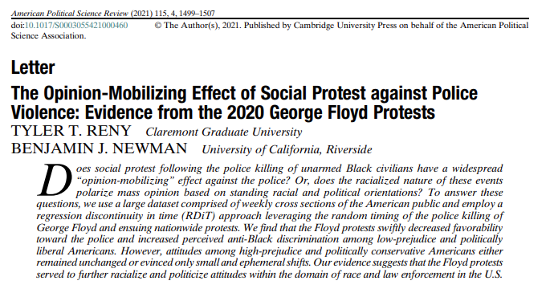
```

---

```{r, echo = FALSE, out.width="60%", fig.retina = 1, fig.align='center'}
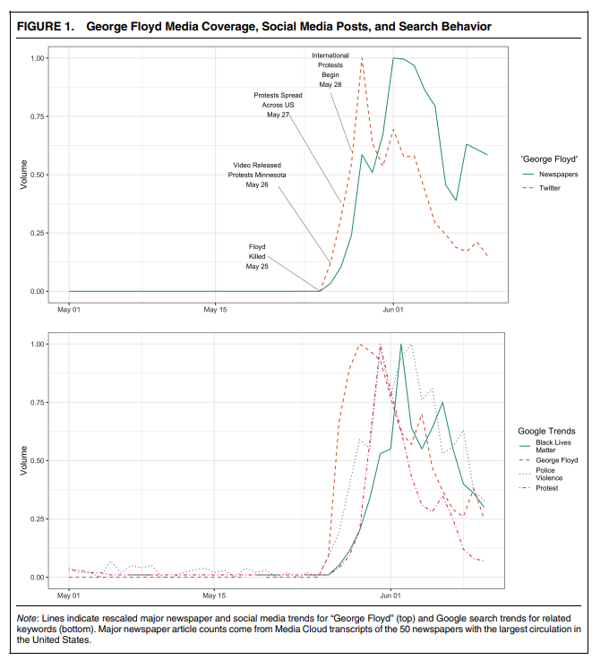
```

---

```{r, echo = FALSE, out.width="80%", fig.retina = 1, fig.align='center'}
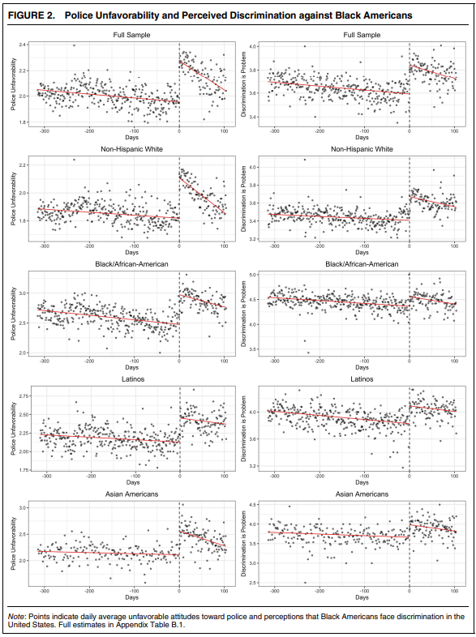
```

---

```{r, echo = FALSE, out.width="100%", fig.retina = 1, fig.align='center'}
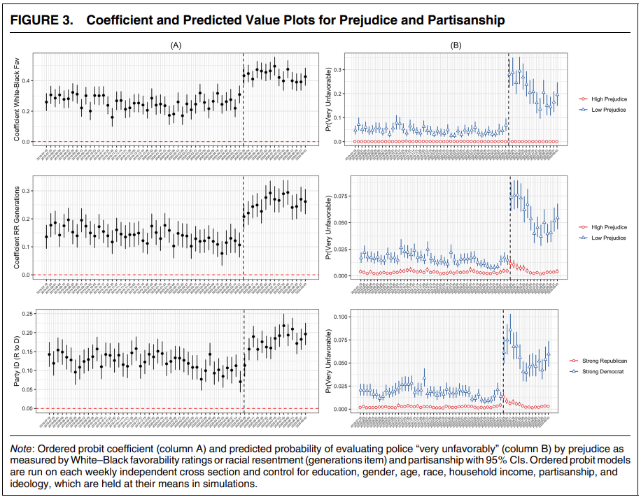
```
