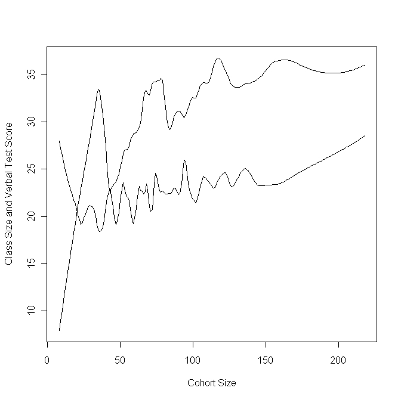

```{r setup, include=FALSE}
knitr::opts_chunk$set(echo = TRUE, warning = FALSE, message = FALSE)
library(tidyverse)
library(broom)
library(ggplot2)
library(knitr)
```

## Today's Roadmap

1. **Hook & Activation:** Matching designs to their "signature"  
2. **Design Detective:** Three scenarios—you decide the strategy  
3. **Group Brainstorm:** Apply a design to **your** research question  
4. **Case Study Deconstruction:** RDD in practice  
5. **Core Graded Activity:** Write your paragraph for the TA  
6. **Wrap‑Up:** Cheat sheet of identification strategies  

**Goal:** Move from "I've heard of IV" to "I can choose and justify a quasi‑experimental design for my own project."

---

class: inverse, center, middle

# 1. Hook & Activation  
### Matching Designs to Their "Signature"

---

## Quick Check: Which Design Is It?

For each description, select the **best‑fitting** design:

| Description | Design Options |
|-------------|----------------|
| 1. Uses a cutoff in a continuous assignment variable to compare just‑above vs. just‑below | A. IV‑type Natural Experiment |
| 2. Compares the change over time in a treated group to the change in a never‑treated group | B. RDD |
| 3. Uses a random lottery or draft number that affects treatment *as if* random | C. DiD |
| 4. Creates a counterfactual from a weighted average of untreated units that mimic the treated unit | D. Synthetic Control |

**Answers on next slide →**

---

## Matching Answers

| Description | Best‑Fitting Design |
|-------------|---------------------|
| 1. Cutoff in assignment variable | **RDD** |
| 2. Change over time vs. change in control | **DiD** |
| 3. Random lottery/draft affecting treatment | **IV‑type Natural Experiment** |
| 4. Weighted average of untreated units | **Synthetic Control** |

> **Key takeaway:** Each design exploits a different kind of "as‑if" random variation.

---

class: inverse, center, middle

# 2. "Design Detective" Diagnostic  
### Three Scenarios—You Decide the Strategy

---

## Scenario 1: Birthdays and Drinking

> Researchers want to estimate the effect of alcohol consumption on grades. They compare students who turned 21 just before finals week to those who turned 21 just after finals week.

**Question:** Which design is implicitly being used here?

- [ ] Instrumental Variables  
- [ ] Difference‑in‑Differences  
- [ ] **Regression Discontinuity (RDD)**  
- [ ] Synthetic Control

---

**Why?** The forcing variable is *days from 21st birthday*; the cutoff is the birthday. The design compares those just on either side of the cutoff.

---

## Scenario 2: State Policy Adoption

> Several states raise their minimum wage in 2022. Researchers compare the change in employment in those states from 2021 to 2023 with the change in states that did **not** raise the minimum wage over the same period.

**Question:** Which design is this?

- [ ] IV  
- [ ] **Difference‑in‑Differences (DiD)**  
- [ ] RDD  
- [ ] Classic Natural Experiment

---

**Why?** Pre‑post change in treated group minus pre‑post change in control group = DiD.

---

## Scenario 3: Vietnam Draft Lottery

> A researcher uses the randomly assigned draft lottery number to estimate the effect of military service on later‑life earnings, even though not everyone with a low number actually served.

**Question:** Which design is this?

- [ ] **Instrumental Variables (IV) / IV‑type Natural Experiment**  
- [ ] RDD  
- [ ] DiD  
- [ ] Matching

---

**Why?** The lottery number is a **random instrument** for military service. The causal effect is estimated via two‑stage least squares (2SLS).

---
### Common Pitfalls to Avoid

- **RDD:** Forgetting to check for manipulation at the cutoff.  
- **DiD:** Assuming parallel trends without checking pre‑period data.  
- **IV:** Using a weak instrument or one that plausibly affects the outcome through other channels.  
- **Synthetic Control:** Choosing donor units that are fundamentally unlike the treated unit.

**You will be asked to justify the *credibility* of your design—these are the threats you need to address.**

---

class: inverse, center, middle

# 3. Group Brainstorm  
### Apply a Design to **Your** Research Question

---

## Cheat Sheet: Natural Experiments & Quasi‑Experimental Designs

| Design | Identification Strategy | Data Requirements | Key Assumption |
|--------|------------------------|--------------------|----------------|
| **IV‑type NE** | As‑if random instrument affects treatment | Instrument, treatment, outcome | Exclusion restriction |
| **RDD** | Discontinuity at cutoff in assignment variable | Assignment variable, outcome | No manipulation at cutoff |
| **DiD** | Parallel trends in pre‑treatment period | Panel data, treated & untreated units | Parallel trends would have continued |
| **Synthetic Control** | Weighted combination of untreated units | One treated unit, many untreated with long pre‑period | Donor pool can reproduce treated unit's pre‑trends |

> **Single most important rule:** Always be explicit about *what variation identifies your effect* and *why that variation is plausibly exogenous*.

---

## Practical Note

- It will typically be hardest to actually find credible natural experiments just existing in the world, making IV challenging to use.
- RDD, DiD and synthetic control can be manufactured in a lot of situations, so you may find that one of these fits your project, potentially with some shifting to how you frame your question.

---

## Guided Worksheet (15 minutes)

**Step 1:** Write your group’s research question on a whiteboard or shared doc.

**Step 2:** For **each** of the four designs below, answer: *Could this design, in principle, answer our question? What data or variation would we need?*

| Design | Is it feasible for our question? (Yes / Maybe / No) | What data would we require? |
|--------|-----------------------------------------------------|-----------------------------|
| IV‑type Natural Experiment | | |
| RDD | | |
| DiD | | |
| Synthetic Control | | |

**Step 3:** **Choose one design** that seems most plausible given your group’s context and available data.

**Step 4:** Draft a **one‑sentence identification argument** (e.g., *"We will use a difference‑in‑differences design comparing counties that adopted the policy in 2020 to those that did not, under the assumption of parallel pre‑trends."*)

---

## Example Application: "Do voter ID laws reduce turnout?"

- **IV:** Find a natural experiment where some precincts got new ID requirements for exogenous reasons (e.g., court order).
- **RDD:** Use a continuous measure of *strictness* of ID law (e.g., number of acceptable IDs) and a cutoff for "strict" vs. "non‑strict."
- **DiD:** Compare states that implemented a law between 2012 and 2016 to states that did not.
- **Synthetic Control:** Build a synthetic version of a state that passed a law using donor states.


---

class: inverse, center, middle

# 4. Case Study Deconstruction  
### RDD in Practice

---

## The Research Question

> Does smaller class size improve student test scores?

**Challenge:** Class size is not random—wealthier districts have smaller classes *and* higher scores.  
**Solution:** Exploit a **regression discontinuity**.

---
### Example: Maimonides' Rule

> "The number of pupils assigned to each teacher is twenty-five. If
> there are fifty, we appoint two teachers. If there are forty, we
> appoint an assistant, at the expense of the town." (Baba Bathra,
> Chapter II, page 21a; translated by Epstein 1976: 214)

---
### Example: Maimonides' Rule

> "Twenty-five children may be put in charge of one teacher. If the
> number in the class exceeds twenty-five but is not more than forty, he
> should have an assistant to help with the instruction. If there are
> more than forty, two teachers must be appointed." (Maimonides, given
> in Hyamson 1937: 58b)

---
### Example: Maimonides' Rule

-   Maimonides' Rule is used to determine class sizes in Israel.

-   Angrist and Lavy (1999) use this to carry out an RDD analysis of the
    effects of class size on educational outcomes.

---
### Example: Maimonides' Rule

```{r, echo = FALSE, out.width="65%", fig.retina = 1, fig.align='center'}

```

---
### Example: Maimonides' Rule

```{r, echo = FALSE, out.width="65%", fig.retina = 1, fig.align='center'}
include_graphics("images/maimonmath.jpeg")
```

---
### RDD: The Key Assumption

> **No manipulation of the running variable at the cutoff.**

- In Maimonides' Rule: Can parents systematically enroll their child in a school with 39 students instead of 41 to get a smaller class?
- If manipulation is possible, the "as‑if random" comparison breaks.

**Check:** Histogram of enrollment counts around the cutoff. A smooth distribution with no bunching just below 40 would be reassuring.

---

```{r, echo = FALSE, out.width="85%", fig.retina = 1, fig.align='center'}
include_graphics("images/Angrist2019title.PNG")
```

---

```{r, echo = FALSE, out.width="85%", fig.retina = 1, fig.align='center'}
include_graphics("images/Angrist2019-1.PNG")
```

---

```{r, echo = FALSE, out.width="85%", fig.retina = 1, fig.align='center'}
include_graphics("images/Angrist2019-2.PNG")
```

---

Does it seem like there is manipulation? If so, who is doing it?

---
### Regression Discontinuity Design: Summary

**The Big Idea**: Treatment is assigned by a cutoff on a continuous running variable. Comparing units just above and just below the cutoff mimics randomization.

---

class: inverse, center, middle

# 5. Core Graded Activity  
### Write Your Paragraph for the TA

---

## Instructions

**By the end of class today, email your TA a short paragraph that includes:**

1. Your group’s research question (one sentence).  
2. The **design** you have chosen (IV, RDD, DiD, Synthetic Control).  
3. A **concrete description** of how you would implement the design with data you could realistically obtain (or mimic in a proposal).  
4. **Why this design is credible** for your question—what source of variation are you exploiting and what is the key identifying assumption?

---

## Example Paragraph (for a different question)

> *Our group asks: Does implementing automatic voter registration (AVR) increase turnout among citizens under 30? We will use a synthetic control design. We plan to construct a "synthetic" treatment state using a weighted combination of states that did not adopt AVR but had comparable pre‑adoption trends in youth turnout, registration rates, and college‑age population. The key assumption is that, absent AVR, the treatment state would have followed the same youth‑turnout trajectory as the synthetic control. This design is credible because AVR adoption has been driven largely by partisan control of state government and policy diffusion networks rather than pre‑existing turnout differences.*

---

## Reminders

- One submission per student.  

