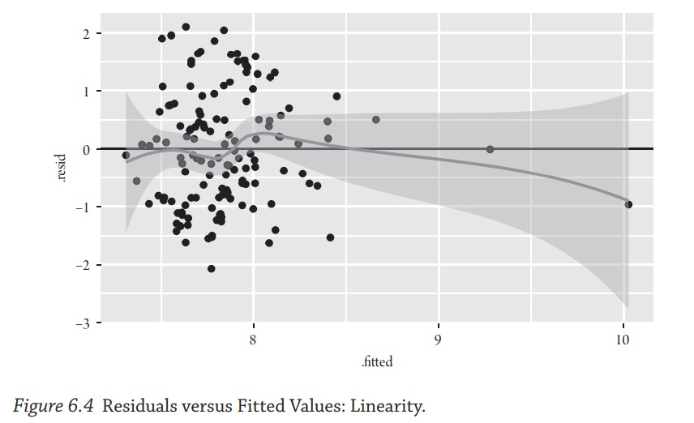

## PS 312 Statistical Research Methods

[Syllabus](https://jnseawright.github.io/PS312/syllabus312spring2025.pdf)

### 2025 Class Materials

* [Tuesday, April 1st: Asking Data Science Questions in Political Science](https://jnseawright.github.io/PS312/1datasciencequestions.html#1)
* [Tuesday, April 1st Activity](https://northwestern.az1.qualtrics.com/jfe/form/SV_5uOxFTWDWGpl0V0)

### Lab Assignments

* [Lab 1: Due April 11](https://jnseawright.github.io/PS312/Lab1.html)
* [Lab 2: Due April 18](https://jnseawright.github.io/PS312/Lab2.html) 
* [Lab 3: Due April 25](https://jnseawright.github.io/PS312/Lab3.html)
* [Lab 4: Due May 2](https://jnseawright.github.io/PS312/Lab4.html)
* [Lab 5: Due May 9](https://jnseawright.github.io/PS312/Lab5.html) 
* [Lab 6: Due May 16](https://jnseawright.github.io/PS312/Lab6.html)
* [Lab 7: Due May 23](https://jnseawright.github.io/PS312/Lab7.html)
* [Final Paper: Due June 10](https://jnseawright.github.io/PS312/finalpaper.html)

### Slides and Code from the 2024 Class

* [Thursday, March 28th: Finding Good Questions in Statistical Social Science](https://jnseawright.github.io/PS312/1goodquestions.html#1)
* [Tuesday, April 2nd: What Is Causation, Anyway?](https://jnseawright.github.io/PS312/2causation.html#1) 
* [Thursday, April 4th: Finding or Creating Statistical Data](https://jnseawright.github.io/PS312/3data.html#1)
* [Tuesday, April 9th: Getting Started with R](https://jnseawright.github.io/PS312/4Rfun.html#1)
* [Thursday, April 11th: Good Description](https://jnseawright.github.io/PS312/5description.html#1) 
* [Tuesday and Thursday, April 16th and 18th: Quantitative Social Science in Practice I and II](https://jnseawright.github.io/PS312/6practicepartone.html#1) 
* [Tuesday, April 23rd: Description and Significance Tests in R](https://jnseawright.github.io/PS312/8descriptionsignificance.html#1) 
* [Thursday, April 25th: Why is Regression Everywhere?](https://jnseawright.github.io/PS312/9regressioneverywhere.html#1) 
* [Tuesday, April 30th: Regression in R](https://jnseawright.github.io/PS312/10basicregression.html#1) 
* [Thursday, May 2nd: Choosing Control Variables](https://jnseawright.github.io/PS312/11controlvariables.html#1) 
* [Tuesday, May 7th: More Complicated Regressions](https://jnseawright.github.io/PS312/12regressionextensions.html#1) 
* [Thursday, May 9th: Crafting Good Regressions in Our Work](https://jnseawright.github.io/PS312/13craftingourregressions.html#1) 
* [Tuesday, May 14th: Regression and Non-Linearity](https://jnseawright.github.io/PS312/14nonlinearity.html#1) 
* [Thursday, May 16th: Interactions and Mediation](https://jnseawright.github.io/PS312/15mediation.html#1) 
