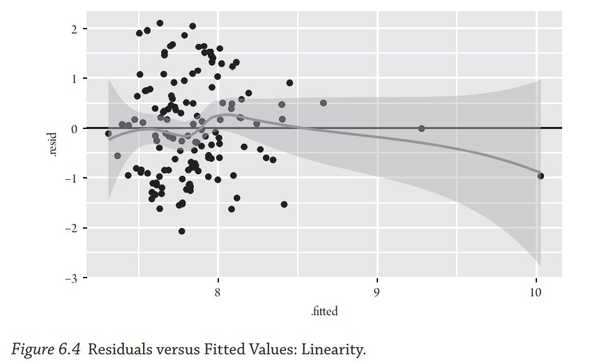

## PS 312 Statistical Research Methods

[Syllabus](https://jnseawright.github.io/PS312/syllabus.html)

### Class Sessions

*Thursday, April 2nd: Finding Good Questions in Statistical Social Science*

Before class, read The Effect, Chapters 1-2.

Class activity: We will brainstorm a list of topics that social scientists study, and you will cluster yourselves into groups of 3-5 based on interest in specific topics. Then your job is to find a good quantitative research question connected to that topic. Each student will then send their TA an email describing that question and why they think it will work.

*Tuesday, April 7th: Getting Started with R*

Before class, read: Li, Chapters 1-2

If you are new to R, work through the [online introduction](https://rpubs.com/odenipinedo/introduction-to-R).

It may be helpful to have a video introduction; I recommend [this one](https://www.youtube.com/watch?v=eYv_UjKwQ3I).

Class activity:  Get together with your group from last time. Your task is to recreate one of the graphs [this web tutorial](https://rforpoliticalscience.com/2024/04/04/how-to-download-and-graph-the-of-democracy-v-dem-dataset-in-r/), either following its steps exactly or changing one or more of the variables to ask a question from the V-DEM data that interests your group. (Focus on producing a clear, static graph for this assignment.) Each group member should send the resulting image to their TA along with a brief paragraph describing the most difficult part of producing it.

*Thursday, April 9th: Causation and Causal Inference*

Before class, read The Effect, Chapters 5-7.

For some extra explanation of the idea of multivariate causation and how that relates to graphs, consider watching [this video](https://www.youtube.com/watch?v=3bUZU23gAxw).

For a nice resource on how to build DAGs in R, consider reading through [these slides](https://lfoswald.github.io/2021-spring-stats2/materials/session-3/03-online-tutorial/#directed-acyclic-graphs-dags-1).

Class activity: Construct a directed acyclic graph (DAG) representing your ideas about the causal factors involved in your team's research question. Each group member should send the DAG to their TA together with a paragraph or two explaining what each element of the image means. If you need help making DAGs in R, use the class [DAG help page](https://jnseawright.github.io/PS312/InClass/Causation_Causal_Inference.html) or review [the slides](https://lfoswald.github.io/2021-spring-stats2/materials/session-3/03-online-tutorial/#directed-acyclic-graphs-dags-1) that were linked in the before-class reading section.

*Tuesday, April 14th: Regression*

Before class, read The Effect, Chapters 4 and 13.

For video explanation, consider these discussions of [linear regression](https://www.youtube.com/watch?v=7ArmBVF2dCs), [multiple regression](https://www.youtube.com/watch?v=zITIFTsivN8), and [how to do regression in R](https://www.youtube.com/watch?v=hokALdIst8k).

Class activity: How does electoral support for Donald Trump in 2016 relate to the pattern of domestic terrorism in the US in subsequent years? Is there more terrorism in Trump-supporting areas or in areas that oppose Trump? Alternatively, is terrorism unrelated to voting patterns? Use the available data and your knowledge of regression to provide the best analysis of these questions that you can. Produce one table and one figure to summarize your key findings. Each group member should send these together with a paragraph-length explanation to their TA.  There is [a page with some resources to help with loading the data and setting up regression](https://jnseawright.github.io/PS312/InClass/Regression.html).

*Thursday, April 16th: Choosing Control Variables*

Before class, watch [this video about back-door paths and controls](https://www.youtube.com/watch?v=IajzIKW518M).

Class activity: Elaborate the group's DAG to include appropriate control variables. Show at least three variables that make sense as confounders. Each student should send the DAG to their TA. Include as well an explanation for why one of the variables meets the definition of a confounder; also explain why one variable the group chose not to include does not meet that definition.

*Tuesday, April 21st: More Advanced Social-Science Designs*

Before class, read The Effect, Chapters 18-21

Here is [a quick video explanation of the idea of natural experiments in political science](https://www.youtube.com/watch?v=1nt8ATK3s-k). Here is a helpful and short, if a bit older, [video introduction to regression-discontinuity designs](https://www.youtube.com/watch?v=gLAlb78p0Fk), [instrumental variables](https://www.youtube.com/watch?v=J2BMFBMO14o), and [difference-in-differences](https://www.youtube.com/watch?v=XFqFH97bDy4).

Class activity: For your group's research question, choose one of the designs we read about/discussed and figure out a way you can use it to answer your question! Each student should write a paragraph to their TA explaining the design they have chosen and why they think it can work.

*Thursday, April 23rd: Difference-in-Differences*

Before class, read [https://mixtape.scunning.com/09-difference_in_differences](https://mixtape.scunning.com/09-difference_in_differences)

I also recommend video explanations of [basic difference-in-differences](https://www.youtube.com/watch?v=95HxUdn-BJg), [parallel trends](https://www.youtube.com/watch?v=ihIWuC6ULjo), and [difference-in-differences with staggered treatments](https://www.youtube.com/watch?v=hu2nDbnpALA).

Class activity: Does transitioning to democracy increase the chance of
military conflict? We can study this with a difference-in-differences
design using historical data on countries' regimes and conflicts, and
you get to do just that. Test as many of your assumptions as you can,
and explain what you learn! If you need help, you can access the [class help sheet on R for difference-in-differences analysis](https://jnseawright.github.io/PS312/InClass/Difference-in-Differences.html). You may also consider looking at this [R tutorial about difference-in-differences for simultaneous treatments](https://rpubs.com/phle/r_tutorial_difference_in_differences) and potentially this [much more thorough if more advanced discussion of difference-in-differences in R](https://mike-data-analysis.share.connect.posit.cloud/sec-difference-in-differences.html).

*Tuesday, April 28th: Synthetic Control*

Before class, read [https://mixtape.scunning.com/10-synthetic_controls](https://mixtape.scunning.com/10-synthetic_controls).

Here is [a helpful and thorough video introduction to synthetic controls](https://www.youtube.com/watch?v=vmx3R8emVjQ).

Class activity: Did Brexit in 2016 set the UK on a path of democratic
backsliding? We can study this with a synthetic control design using
historical data on countries' regimes, and you get to do just that.
Present graphs and other results to explain your analysis, showing the
quality of the control before the treatment as well as the size of any
effect afterwards. If you need resources to help with coding issues, you can access the [class help file on synthetic control analysis in R](https://jnseawright.github.io/PS312/InClass/Synthetic_Control.html). You may also reference [this more detailed and general discussion of of synthetic controls in R](https://www.r-bloggers.com/2023/07/when-numbers-meet-stories-an-introduction-to-the-synthetic-control-method-in-r/).

*Thursday, April 30th: Regression-Discontinuity Designs*

Before class, read [https://mixtape.scunning.com/06-regression_discontinuity](https://mixtape.scunning.com/06-regression_discontinuity)

For video discussion, watch this [introductory video on regression-discontinuity designs](https://www.youtube.com/watch?v=5FM4-xbaS58), this one on [estimating RDD effects](https://www.youtube.com/watch?v=FPBQL0OKmI0), this one on [adjustments to RDD](https://www.youtube.com/watch?v=3HazJ8Tv6d0), and this one on [checking RDD assumptions](https://www.youtube.com/watch?v=WJ7j08xVegY).

Class activity: Is ideological polarization in the US happening equally on both sides of the party system, or do the parties behave differently in terms of their distance from the ideological middle? Let's try to get an answer to this that cleans up some of the background noise by using a regression-discontinuity design. We'll compare close elections that Republicans just barely win to close elections that Democrats just barely win and look at the absolute value of the resulting ideological distance from the middle of the elected representatives. Working with your group, find numerical estimates of the effect of switching party within this design, significance tests, and a plot that visualizes the results, the underlying data, and the design. Send these, together with a brief description of your conclusions, to your TA. If you need resources to help with coding issues, you can access the [class help file on regression-discontinuity designs](https://jnseawright.github.io/PS312/InClass/Regression_Discontinuity_Designs.html), or you can follow these two [video](https://vimeo.com/400826628) [tutorials](https://vimeo.com/400826660).

*Tuesday, May 5th: Instrumental Variables Designs*

Before class, read [https://mixtape.scunning.com/07-instrumental_variables](https://mixtape.scunning.com/07-instrumental_variables).

I also recommend watching this [helpful video explanation of instrumental variables](https://www.youtube.com/watch?v=eoJUPd6104Q).

Class activity: Does higher turnout help Democrats, Republicans, both, or neither? Let's try to find out by using bad weather as an instrumental variable to predict turnout. Run a standard regression predicting Republican vote share based on turnout, and also an instrumental-variables analysis adding rain- and snow-fall as instruments. Are there differences between the two? Are there signs of trouble for the instruments, or do they seem reasonable? Examine Google Scholar to see how popular instruments like these are in the social sciences. What, if anything, can we conclude about the validity of these as instruments from the applications you have seen? Each student should write a brief description of the findings and an evaluation of the credibility of the analysis and send the results to their TA. If you need help with coding, you can access the [class help page on instrumental variables in R](https://jnseawright.github.io/PS312/InClass/Instrumental_Variables.html). You can also access this [somewhat more detailed R tutorial on instrumental variables](https://rpubs.com/wsundstrom/t_ivreg).

*Thursday, May 7th: Social Science Transparency Practices*

Before class, read Christensen, Garret, Zenan Wang, Elizabeth Levy
Paluck, Nicholas Swanson, David Birke, Edward Miguel, and Rebecca
Littman."Open science practices are on the rise: The state of social
science (3S) survey." (2020). [https://escholarship.org/uc/item/0hx0207r](https://escholarship.org/uc/item/0hx0207r)

It may also be productive to watch this [reasonably long but very informative talk on open social science](https://www.youtube.com/watch?v=CJ0kPic7fjA).

Class activity: for a research question randomly provided for your
group, find at least five published quantitative articles and evaluate
the transparency practices of those articles. Was there preregistration,
are data and code available for replication, etc.? Search for at least
one preregistration form related to the research question to see the
format of such documents.

*Tuesday, May 12th: Missing Data*

Before class, read [this overview of the problem of missing data.](https://www.publichealth.columbia.edu/research/population-health-methods/missing-data-and-multiple-imputation)

You may also get value out of [this video explanation of categories of missingness](https://www.youtube.com/watch?v=UzsWr9X98J8), as well as [this introduction to multiple imputation](https://www.youtube.com/watch?v=f6YLnK27LyE).

Class activity: Let's look at whether missing data are a problem in the study of democracy and economic development. With your group, access the Quality of Governance (QoG) dataset, and assemble a regression model predicting countries' level of democracy based on per capita GDP and any control variables you see as relevant. Are there missing data? What are some possible solutions? Show how implementing a good solution would modify the results (if at all). Each student should send a table showing the original regression results and the results correcting for missing data to their TA, along with a paragraph discussing the extent to which missing data made a difference in the results. If you need coding help, you can access [the class help page on missing data analysis](https://jnseawright.github.io/PS312/InClass/Missing_Data.html). You may also take advantage of this [somewhat more thorough tutorial on missing data and imputation in R](https://libguides.princeton.edu/R-Missingdata).

*Thursday, May 14th: Common Pitfalls*

Before class, read [this inventory of common mistakes in quantitative research.](https://pmc.ncbi.nlm.nih.gov/articles/PMC9477699/)

You may also find [this related and partially overlapping video about statistical fallacies](https://www.youtube.com/watch?v=zzJgn12le4Q) useful.

Class activity: What would it look like for your group project this quarter to make each of the mistakes we've highlighted this week? Describe the worst-case scenario where you would fall into each pitfall, and discuss how you can avoid that. As a group, create a table with three columns: the name of the pitfall, a sketch of the scenario where your project would really be subject to that criticism, and a set of precautions you can take to avoid that. Send this table to each TA together with the names of the group members.

*Tuesday, May 19th: Writing Quantitative Social Science*

Before class, read BOTH [Daniel M Butler, Elin Naurin, and Patrik
Öhberg, "Constituents Ask Female Legislators to do More." *The Journal
of Politics*. Forthcoming.
https://doi.org/10.1086/719631](https://doi.org/10.1086/719631)

AND

[Noam Lupu and Leonid Peisakhin, 2017, "The Legacy of Political Violence
across Generations." *American Journal of Political Science* 61 (Oct.):
836-51.](https://doi.org/10.1111/ajps.12327)

It will also be exceptionally helpful if you take the seven minutes to watch this careful video on [how to structure social-science papers](https://www.youtube.com/watch?v=6xVNhIRPTt8).

We will discuss together the features of well-written quantitative
social science, and how to structure a successful paper/article in this
genre.

*Thursday, May 21st: In-Class Presentations Day 1*

If your group did not present on this day, please send your TA a summary of your participation. This may take three forms. First, if you were a discussant for one of the presentations, you can mention that. Second, if you participated in one or more Q&A sessions, describe your participation. Third, because there may not always be time for everyone to actively speak in every session, you can write a couple of paragraphs discussing what you saw as the strengths and weaknesses of today's presentations.

*Tuesday, May 26th: In-Class Presentations Day 2*

If your group did not present on this day, please send your TA a summary of your participation. This may take three forms. First, if you were a discussant for one of the presentations, you can mention that. Second, if you participated in one or more Q&A sessions, describe your participation. Third, because there may not always be time for everyone to actively speak in every session, you can write a couple of paragraphs discussing what you saw as the strengths and weaknesses of today's presentations.

*Thursday, May 28th: In-Class Presentations Day 3*

If your group did not present on this day, please send your TA a summary of your participation. This may take three forms. First, if you were a discussant for one of the presentations, you can mention that. Second, if you participated in one or more Q&A sessions, describe your participation. Third, because there may not always be time for everyone to actively speak in every session, you can write a couple of paragraphs discussing what you saw as the strengths and weaknesses of today's presentations.

### Labs

*  [Lab 1: Due April 17](https://jnseawright.github.io/PS312/Labs/Lab1.html)
*  [Lab 2: Due April 24](https://jnseawright.github.io/PS312/Labs/Lab2.html)
*  [Lab 3: Due May 1](https://jnseawright.github.io/PS312/Labs/Lab3.html)
*  [Lab 4: Due May 8](https://jnseawright.github.io/PS312/Labs/Lab4.html)
*  [Lab 5: Due May 15](https://jnseawright.github.io/PS312/Labs/Lab5.html)
*  [Lab 6: Due May 22](https://jnseawright.github.io/PS312/Labs/Lab6.html)
*  [Lab 7: Due May 29](https://jnseawright.github.io/PS312/Labs/Lab7.html)
